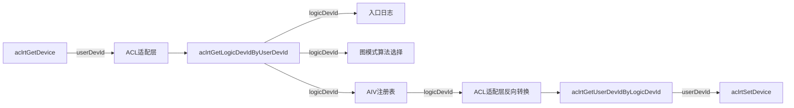

# aclrtGetDevice返回值转换为逻辑设备ID修改方案

## 1. 文档信息

| 项目 | 内容 |
|---|---|
| 文档状态 | 修改方案 |
| 适用仓库 | HCCL |
| 基线CANN版本 | 9.1.0 |
| 编写日期 | 2026-07-22 |
| 改动性质 | 内部设备ID语义修正，不涉及对外API变更 |

## 2. 背景与问题

HCCL当前在18处源码位置直接调用`aclrtGetDevice`。这些调用点普遍将返回值保存到
`deviceLogicId`或`deviceId`变量，并按逻辑设备ID使用。

实际接口语义为：

- `aclrtGetDevice(int32_t *deviceId)`返回当前线程对应的`userDevId`；
- `aclrtGetLogicDevIdByUserDevId(userDevId, &logicDevId)`负责将`userDevId`转换为`logicDevId`；
- `aclrtGetUserDevIdByLogicDevId(logicDevId, &userDevId)`负责反向转换。

当前实现缺少转换步骤，因此在`userDevId`与`logicDevId`不相等的环境中可能产生以下问题：

1. 算子入口日志记录的`deviceLogicId`实际是`userDevId`，维测信息不准确；
2. 图模式算法选择阶段获取的设备ID语义错误；
3. AIV内核注册表以错误的ID域作为设备键，多设备或设备映射场景下可能发生注册、查找和卸载不一致；
4. 现有ST桩中两类ID相等，无法暴露该问题。

## 3. 目标与非目标

### 3.1 修改目标

1. HCCL业务代码统一使用`logicDevId`，不直接把`aclrtGetDevice`返回值当作逻辑设备ID；
2. 在ACL适配层集中实现`userDevId`与`logicDevId`转换，避免18处重复代码；
3. AIV注册、查找、更新和卸载流程统一以`logicDevId`作为内部设备键；
4. 调用只接受`userDevId`的ACL接口时，在适配层边界完成反向转换；
5. 保持现有错误处理和算子返回行为；
6. 补齐ST桩和非等值映射验证。

### 3.2 非目标

1. 不修改`include/hccl.h`等对外API；
2. 不修改HCOMM接口，也不引入HCCL对HCOMM的编译期依赖；
3. 不调整算法选择策略或AIV内核注册生命周期；
4. 不改变日志字段名称和日志开关行为；
5. 不使用“转换失败时直接把`userDevId`当作`logicDevId`”的兼容回退。

## 4. 现状确认

### 4.1 CANN接口可用性

当前安装包路径：

```text
/home/ytz/CANN/Ascend/cann-9.1.0
```

`include/acl/acl_rt.h`中存在以下声明：

```cpp
aclError aclrtGetDevice(int32_t *deviceId);

aclError aclrtGetLogicDevIdByUserDevId(
    const int32_t userDevid,
    int32_t *const logicDevId);

aclError aclrtGetUserDevIdByLogicDevId(
    const int32_t logicDevId,
    int32_t *const userDevid);
```

`libascendcl.so`已导出正向和反向转换符号，因此基于CANN 9.1.0构建时不需要新增链接库。

### 4.2 调用点统计

`src/`中共有18处`aclrtGetDevice`直接调用，分布在15个文件：

| 类别 | 数量 | 当前用途 |
|---|---:|---|
| 算子入口日志 | 15 | 获取并打印`deviceLogicId` |
| 图模式算法选择 | 1 | 检查当前设备并获取设备ID |
| AIV注册/查找 | 1 | 获取当前设备并作为注册表键 |
| AIV卸载/恢复 | 1 | 保存当前设备并在逐设备卸载后恢复 |

测试目录另有1处`aclrtGetDevice`桩实现。

## 5. 总体设计

### 5.1 ID语义边界

HCCL内部统一使用`logicDevId`。仅在调用明确要求`userDevId`的ACL接口时进行反向转换。



### 5.2 统一适配接口

在`src/common/adapter_acl.h`和`src/common/adapter_acl.cc`中新增两个内部接口：

```cpp
HcclResult AclrtGetCurrentLogicDeviceId(s32 &deviceLogicId);

HcclResult AclrtSetDeviceByLogicDeviceId(s32 deviceLogicId);
```

接口职责：

- `AclrtGetCurrentLogicDeviceId`：获取当前`userDevId`并转换为`logicDevId`；
- `AclrtSetDeviceByLogicDeviceId`：将`logicDevId`反向转换为`userDevId`后调用`aclrtSetDevice`；
- 两个接口均位于`ops_hccl`命名空间，仅供仓内使用；
- 不加入`include/`，不形成新的对外ABI。

建议实现：

```cpp
HcclResult AclrtGetCurrentLogicDeviceId(s32 &deviceLogicId)
{
    s32 userDevId = 0;
    aclError ret = aclrtGetDevice(&userDevId);
    CHK_PRT_RET(ret != ACL_SUCCESS,
        HCCL_ERROR("[AclrtGetCurrentLogicDeviceId] aclrtGetDevice failed, ret[%d]", ret),
        HCCL_E_RUNTIME);

    ret = aclrtGetLogicDevIdByUserDevId(userDevId, &deviceLogicId);
    CHK_PRT_RET(ret != ACL_SUCCESS,
        HCCL_ERROR("[AclrtGetCurrentLogicDeviceId] convert userDevId[%d] failed, ret[%d]", userDevId, ret),
        HCCL_E_RUNTIME);
    return HCCL_SUCCESS;
}

HcclResult AclrtSetDeviceByLogicDeviceId(s32 deviceLogicId)
{
    s32 userDevId = 0;
    aclError ret = aclrtGetUserDevIdByLogicDevId(deviceLogicId, &userDevId);
    CHK_PRT_RET(ret != ACL_SUCCESS,
        HCCL_ERROR("[AclrtSetDeviceByLogicDeviceId] convert logicDevId[%d] failed, ret[%d]",
            deviceLogicId, ret),
        HCCL_E_RUNTIME);

    ret = aclrtSetDevice(userDevId);
    CHK_PRT_RET(ret != ACL_SUCCESS,
        HCCL_ERROR("[AclrtSetDeviceByLogicDeviceId] set userDevId[%d] for logicDevId[%d] failed, ret[%d]",
            userDevId, deviceLogicId, ret),
        HCCL_E_RUNTIME);
    return HCCL_SUCCESS;
}
```

说明：最终实现应按项目格式化规则控制在120列内。若相关目标参与`AICPU_COMPILE`，应沿用
`adapter_acl.cc`现有条件编译策略，但不得在不执行转换时返回一个未初始化或伪造的逻辑设备ID。

## 6. 分模块修改方案

### 6.1 公共ACL适配层

涉及文件：

- `src/common/adapter_acl.h`
- `src/common/adapter_acl.cc`

修改内容：

1. 声明并实现第5.2节的两个适配接口；
2. 正向转换失败统一返回`HCCL_E_RUNTIME`；
3. 日志同时打印输入ID、转换方向和ACL错误码，便于定位映射问题；
4. 不缓存映射关系，避免设备可见性或运行时配置变化造成缓存失效；
5. 不修改已有`haclrtGetDeviceIndexByPhyId`，该接口处理的是`phyDevId -> logicDevId`，语义不同。

### 6.2 算子入口日志

以下15处调用统一替换：

```cpp
s32 deviceLogicId = 0;
CHK_RET(AclrtGetCurrentLogicDeviceId(deviceLogicId));
```

| 文件 | 函数/位置 | 调整内容 |
|---|---|---|
| `src/ops/all_gather/all_gather_op.cc` | `AllGatherEntryLog` | 日志使用转换后的`deviceLogicId` |
| `src/ops/all_gather_v/all_gather_v_op.cc` | `AllGatherVEntryLog` | 同上 |
| `src/ops/all_reduce/all_reduce_op.cc` | `AllReduceEntryLog` | 同上 |
| `src/ops/all_to_all_v/all_to_all_v_op.cc` | `AlltoAllEntryLog` | 同上 |
| `src/ops/all_to_all_v/all_to_all_v_op.cc` | `AlltoAllVEntryLog` | 同上 |
| `src/ops/all_to_all_v/all_to_all_v_op.cc` | `AlltoAllVCEntryLog` | 同上 |
| `src/ops/barrier/barrier_op.cc` | `BarrierEntryLog` | 同上 |
| `src/ops/batch_send_recv/batch_send_recv_op.cc` | `BatchSendRecvEntryLog` | 同上 |
| `src/ops/broadcast/broadcast_op.cc` | `BroadcastEntryLog` | 同上 |
| `src/ops/recv/recv_op.cc` | `RecvEntryLog` | 同上 |
| `src/ops/reduce/reduce_op.cc` | `ReduceEntryLog` | 同上 |
| `src/ops/reduce_scatter/reduce_scatter_op.cc` | `ReduceScatterEntryLog` | 同上 |
| `src/ops/reduce_scatter_v/reduce_scatter_v_op.cc` | `ReduceScatterVEntryLog` | 同上 |
| `src/ops/scatter/scatter_op.cc` | `HcclScatter`入口日志块 | 同上 |
| `src/ops/send/send_op.cc` | `SendEntryLog` | 同上 |

行为保持要求：

- 原代码使用`ACLCHECK`，获取失败时返回`HCCL_E_RUNTIME`；替换后使用`CHK_RET`传播适配层错误，保持失败语义；
- 仅在原有Entry Log条件满足时调用转换接口，不增加默认路径上的额外ACL调用；
- 日志字段仍为`deviceLogicId`，但值修正为真实逻辑设备ID。

### 6.3 图模式算法选择

涉及文件：

- `src/ops/interface_graph_mode/calc_resource_graph_mode.cc`

当前`HcclSelectAlgGraphMode`调用`aclrtGetDevice`，变量名为`deviceLogicId`，但获取的是`userDevId`。
修改为：

```cpp
s32 deviceLogicId = 0;
CHK_PRT_RET(AclrtGetCurrentLogicDeviceId(deviceLogicId) != HCCL_SUCCESS,
    HCCL_WARNING("[HcclSelectAlgGraphMode] device is not set."),
    HCCL_SUCCESS);
```

要求保留当前兼容行为：设备未设置或转换失败时只打印告警并返回`HCCL_SUCCESS`，不把图模式算法选择
从“跳过”改成硬失败。

### 6.4 AIV内核注册表

涉及文件：

- `src/ops/op_common/template/aiv/hccl_aiv_utils.cc`

#### 6.4.1 内部ID统一

进行以下语义化调整：

| 当前名称 | 建议名称 | 新语义 |
|---|---|---|
| `GetCurrentDeviceId` | 删除，直接调用公共适配接口 | 避免重复封装 |
| `g_aivRegistryByDevice` | `g_aivRegistryByLogicDevice` | map键为`logicDevId` |
| `AivKernelLookupResult::deviceId` | `deviceLogicId` | 明确为逻辑设备ID |
| `UpdateKernelFunc(deviceId, ...)` | `UpdateKernelFunc(deviceLogicId, ...)` | 使用逻辑设备ID查表 |
| `RegisterKernel`中的`deviceId` | `deviceLogicId` | 注册表按逻辑设备隔离 |
| `GetKernelEntry`中的`deviceId` | `deviceLogicId` | 查找与注册使用相同ID域 |

`RegisterKernel`和`GetKernelEntry`均使用：

```cpp
s32 deviceLogicId = 0;
CHK_RET(AclrtGetCurrentLogicDeviceId(deviceLogicId));
```

#### 6.4.2 卸载与设备恢复

`UnRegisterAivKernel`遍历注册表时，注册表键已变为`logicDevId`。不得把该值直接传给
`aclrtSetDevice`，应通过适配接口反向转换：

```cpp
HcclResult setRet = AclrtSetDeviceByLogicDeviceId(registryIt->first);
```

当前设备保存和恢复也统一使用逻辑设备ID：

```cpp
s32 currentLogicDeviceId = 0;
bool needRestoreDevice =
    (AclrtGetCurrentLogicDeviceId(currentLogicDeviceId) == HCCL_SUCCESS);

// 清理各logicDevId对应的注册表

if (needRestoreDevice) {
    HcclResult restoreRet = AclrtSetDeviceByLogicDeviceId(currentLogicDeviceId);
    // 按现有逻辑记录错误并合并result
}
```

错误处理要求：

1. 保留“某个设备切换失败后继续处理其他设备”的best-effort卸载策略；
2. `g_unregistering`置位后不得因转换失败直接`return`，否则可能导致后续注册永久失败；
3. 无论转换或卸载是否失败，函数退出前都必须恢复`g_unregistering = false`、释放锁并通知条件变量；
4. 恢复设备失败时返回`HCCL_E_RUNTIME`，与当前行为一致；
5. 错误日志同时记录`logicDevId`和转换得到的`userDevId`，避免ID域混淆。

### 6.5 ST运行时桩

涉及文件：

- `test/st/algorithm/utils/src/hccl_proxy/aclrt_stub.cc`

新增桩接口：

```cpp
aclError aclrtGetLogicDevIdByUserDevId(
    const int32_t userDevId,
    int32_t *const logicDevId);

aclError aclrtGetUserDevIdByLogicDevId(
    const int32_t logicDevId,
    int32_t *const userDevId);
```

测试桩不应永远使用恒等映射，否则无法验证本次修复。建议采用可逆的非等值映射，例如：

```text
logicDevId = userDevId + LOGIC_DEVICE_ID_OFFSET
userDevId  = logicDevId - LOGIC_DEVICE_ID_OFFSET
```

`LOGIC_DEVICE_ID_OFFSET`只在模拟器内部使用。已有`aclrtSetDevice`仍接收`userDevId`，由反向转换保证
`curr_dev_id`继续对应模拟Rank，不改变ST拓扑和用例数据。

## 7. 详细改动清单

### 7.1 必改文件

| 序号 | 文件 | 改动类型 |
|---:|---|---|
| 1 | `src/common/adapter_acl.h` | 新增正向/反向适配接口声明 |
| 2 | `src/common/adapter_acl.cc` | 新增接口实现和错误日志 |
| 3 | `src/ops/all_gather/all_gather_op.cc` | Entry Log改用逻辑设备ID |
| 4 | `src/ops/all_gather_v/all_gather_v_op.cc` | Entry Log改用逻辑设备ID |
| 5 | `src/ops/all_reduce/all_reduce_op.cc` | Entry Log改用逻辑设备ID |
| 6 | `src/ops/all_to_all_v/all_to_all_v_op.cc` | 3个Entry Log改用逻辑设备ID |
| 7 | `src/ops/barrier/barrier_op.cc` | Entry Log改用逻辑设备ID |
| 8 | `src/ops/batch_send_recv/batch_send_recv_op.cc` | Entry Log改用逻辑设备ID |
| 9 | `src/ops/broadcast/broadcast_op.cc` | Entry Log改用逻辑设备ID |
| 10 | `src/ops/recv/recv_op.cc` | Entry Log改用逻辑设备ID |
| 11 | `src/ops/reduce/reduce_op.cc` | Entry Log改用逻辑设备ID |
| 12 | `src/ops/reduce_scatter/reduce_scatter_op.cc` | Entry Log改用逻辑设备ID |
| 13 | `src/ops/reduce_scatter_v/reduce_scatter_v_op.cc` | Entry Log改用逻辑设备ID |
| 14 | `src/ops/scatter/scatter_op.cc` | Entry Log改用逻辑设备ID |
| 15 | `src/ops/send/send_op.cc` | Entry Log改用逻辑设备ID |
| 16 | `src/ops/interface_graph_mode/calc_resource_graph_mode.cc` | 图模式获取真实逻辑设备ID |
| 17 | `src/ops/op_common/template/aiv/hccl_aiv_utils.cc` | 注册表键、切换和恢复统一ID语义 |
| 18 | `test/st/algorithm/utils/src/hccl_proxy/aclrt_stub.cc` | 新增双向转换桩 |

### 7.2 预计无需修改

- `include/hccl.h`、`include/hccl_mc2.h`：无对外接口变化；
- CMake文件：CANN 9.1.0的`libascendcl.so`已有所需符号，沿用现有链接关系；
- HCOMM符号表和`src/common/hcomm_dlsym/`：本次调用属于已有AscendCL依赖，不涉及跨仓HCOMM接口；
- 算法selector、executor和template逻辑：不改变算法行为。

## 8. 错误处理与兼容性

### 8.1 错误传播

| 场景 | 当前行为 | 修改后行为 |
|---|---|---|
| Entry Log获取设备失败 | 返回`HCCL_E_RUNTIME` | 保持不变 |
| Entry Log ID转换失败 | 无此检查 | 返回`HCCL_E_RUNTIME` |
| 图模式设备获取失败 | 告警后返回成功 | 保持不变 |
| 图模式ID转换失败 | 无此检查 | 告警后返回成功 |
| AIV注册/查找获取失败 | 返回运行时错误 | 保持不变并覆盖转换失败 |
| AIV某设备切换失败 | 记录错误并继续卸载 | 保持不变 |
| AIV恢复当前设备失败 | 返回运行时错误 | 保持不变 |

### 8.2 版本兼容

本方案以当前CANN 9.1.0为基线。该版本头文件和`libascendcl.so`均已提供双向转换接口。

若HCCL仍需支持缺少该接口的更早CANN版本，应在实施前明确最低构建版本。不得静默退化为把
`userDevId`直接当作`logicDevId`；可选做法是提高最低CANN版本，或单独设计带明确失败语义的兼容层。
该兼容扩展不属于本次修改范围。

## 9. 测试方案

### 9.1 静态检查

修改完成后执行：

```bash
rg -n '\baclrtGetDevice\b' src test
rg -n '\baclrtGetLogicDevIdByUserDevId\b' src test
rg -n '\baclrtGetUserDevIdByLogicDevId\b' src test
```

预期：

- `src/`中`aclrtGetDevice`只保留在公共适配接口内部；
- 业务代码不再直接调用`aclrtGetDevice`；
- 双向转换只由ACL适配层调用；
- ST目录存在对应桩函数。

### 9.2 编译验证

按从快到慢顺序执行：

```bash
bash build.sh --pkg
bash build.sh -u
bash build.sh -s
```

重点确认：

- `aclrtGetLogicDevIdByUserDevId`和`aclrtGetUserDevIdByLogicDevId`声明可见；
- 动态链接无未定义符号；
- 静态库构建场景如属于交付范围，补跑`bash build.sh --static`；
- 编译无未使用变量、符号重复或格式告警。

### 9.3 功能验证

至少覆盖以下场景：

1. **非等值映射**：`userDevId != logicDevId`时，Entry Log打印转换后的`logicDevId`；
2. **多设备AIV注册**：两个不同`userDevId`映射到各自`logicDevId`，注册表互不覆盖；
3. **AIV查找一致性**：注册和执行阶段通过相同`logicDevId`命中同一注册表；
4. **AIV逐设备卸载**：遍历逻辑设备键时能反向转换并成功切换设备；
5. **当前设备恢复**：卸载完成后恢复到进入函数前的设备；
6. **正向转换失败**：日志、图模式和AIV分别保持第8.1节定义的行为；
7. **反向转换失败**：单设备卸载失败不阻断其他设备清理，最终状态和返回码正确；
8. **RankSize为1及常规集合通信**：确认增加转换后不影响算子结果。

### 9.4 日志验证

开启Entry Log后，检查`deviceLogicId`字段与预期逻辑设备ID一致。转换失败日志应能同时看到：

- 转换方向；
- 输入ID；
- ACL返回码；
- 调用函数名。

## 10. 风险分析与控制措施

| 风险 | 等级 | 影响 | 控制措施 |
|---|---|---|---|
| 把`logicDevId`直接传给只接受`userDevId`的接口 | 高 | AIV卸载切错设备或失败 | 所有设备切换统一经过反向转换适配接口 |
| AIV注册与查找使用不同ID域 | 高 | 内核查找失败、重复注册 | 注册表和LookupResult字段显式命名为`LogicDevice` |
| 卸载错误路径未清理`g_unregistering` | 高 | 后续AIV注册永久失败 | 禁止置位后早退，保留统一收尾路径 |
| ST使用恒等映射掩盖问题 | 中 | 修复回归无法被测试发现 | 使用可逆非等值映射并增加断言 |
| 旧CANN包缺少转换符号 | 中 | 编译或加载失败 | 明确9.1.0基线，实施前确认支持矩阵 |
| Entry Log新增一次转换调用 | 低 | 仅日志开启路径有轻微开销 | 不缓存映射，保持正确性优先；默认路径无新增调用 |
| 图模式错误语义被误改为硬失败 | 中 | 原可兼容场景失败 | 保持告警并返回成功的现有策略 |

综合评估：改动涉及18个生产源码文件/调用区域且触及AIV多设备资源生命周期，风险等级为**高**。
通过统一适配层、明确ID域命名和非等值映射测试可将主要风险收敛。

## 11. 架构符合性

1. **分层依赖**：改动位于HCCL内部，继续通过既有ACL适配层调用AscendCL，不引入下层反向依赖；
2. **HCCL/HCOMM解耦**：不包含HCOMM私有头，不修改HCOMM符号表，不增加HCOMM编译期依赖；
3. **控制面/数据面分离**：仅修正设备ID适配和维测/AIV内部索引，不引入控制面实现耦合；
4. **对外API兼容**：`include/`无变化，二进制和源码接口保持兼容；
5. **目录职责**：通用转换落在`src/common/adapter_acl.*`，算子层只消费转换后的逻辑设备ID。

## 12. 实施顺序

建议按以下顺序提交为一个可审查变更：

1. 在ACL适配层增加正向、反向转换接口；
2. 增加ST双向转换桩和非等值映射能力；
3. 替换15处Entry Log调用；
4. 修改图模式算法选择调用；
5. 修改AIV注册表键、查找、更新、逐设备切换及恢复流程；
6. 执行静态搜索、格式检查、构建和ST；
7. 检查最终diff，确认`src/`中不存在业务层直接调用`aclrtGetDevice`的遗留点。

## 13. 验收标准

满足以下条件方可认为修改完成：

- [ ] `src/`业务代码不再直接调用`aclrtGetDevice`；
- [ ] 所有原调用点最终获得并使用真实`logicDevId`；
- [ ] AIV注册表明确以`logicDevId`为键；
- [ ] 所有`aclrtSetDevice`调用仍接收正确的`userDevId`；
- [ ] 正向和反向转换失败路径均有明确日志与返回码；
- [ ] `g_unregistering`在所有卸载路径均能复位；
- [ ] ST桩支持双向、可逆、非等值映射；
- [ ] `--pkg`、UT和ST通过，编译无新增告警；
- [ ] 无`include/`、HCOMM接口或算法行为变更。

