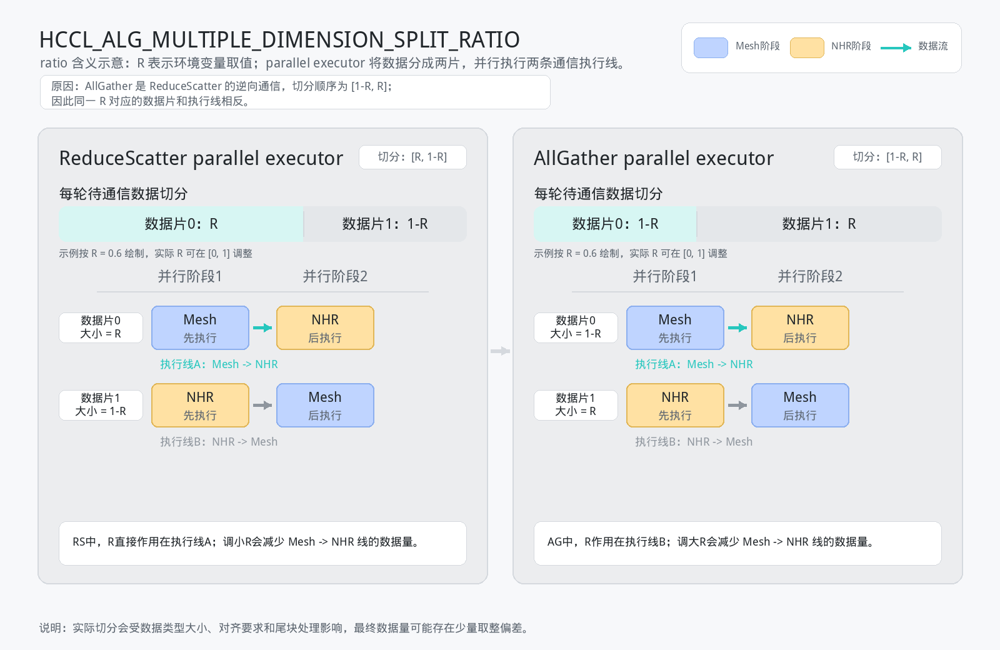

# HCCL_ALG_MULTIPLE_DIMENSION_SPLIT_RATIO

## 功能描述

该环境变量用于配置AllReduce、AllGather、ReduceScatter算子在parallel executor中进行多维度并行编排时的数据切分比例。

parallel executor会将每轮待通信的数据切分为两片，并编排为两条并行执行线：一片数据先执行mesh通信、再执行NHR通信，另一片数据先执行NHR通信、再执行mesh通信。该环境变量用于调整这两片数据的大小，使执行较慢的一条线分配较少数据，执行较快的一条线分配较多数据。

该环境变量需要配置为数字，取值范围：\[0,1\]，默认值：0.5。

需要注意：

- 该环境变量仅影响已选择parallel executor的AllReduce、AllGather、ReduceScatter算子的内部数据切分比例，不用于选择通信算法。
- AllReduce和ReduceScatter算子中，两片数据的目标切分比例为“环境变量取值”和“1-环境变量取值”；AllGather算子中，算法内部使用的两片数据切分顺序与AllReduce、ReduceScatter相反。
- 实际切分时会根据数据类型大小、对齐要求和尾块数据量进行取整或对齐处理，因此实际切分比例可能与配置值存在少量偏差。
- 若未配置该环境变量，或配置的数字超出\[0,1\]范围，系统使用默认值0.5。若配置为非数字格式，系统会在初始化环境变量时返回错误。
- 一般情况下，用户保持默认值即可。仅建议在确认当前算子会选择parallel executor，且需要针对特定组网、数据量进行性能调优时修改该环境变量。

以`R`表示HCCL_ALG_MULTIPLE_DIMENSION_SPLIT_RATIO的取值。



ReduceScatter和AllGather配置相同的`R`时，`R`对应的数据片不同，原因如下：

- ReduceScatter和AllGather的通信语义相反：ReduceScatter将完整输入数据规约并分散到各rank，AllGather则将各rank上的分片数据收集还原为完整输出数据。
- parallel executor内部都使用“数据片0”和“数据片1”编排两条执行线，但两个算子的分片与执行线的对应关系相反。ReduceScatter中，`R`对应数据片0，即“Mesh -> NHR”执行线；AllGather中，`R`对应数据片1，即“NHR -> Mesh”执行线。
- 因此，同样设置`R=0.6`时，ReduceScatter表示“Mesh -> NHR”执行线分配约60%的数据；AllGather表示“NHR -> Mesh”执行线分配约60%的数据。

ReduceScatter算子中，数据片0的大小为`R`，数据片1的大小为`1-R`：

```text
每轮待通信数据
|---------------- 数据片0：R ----------------|------ 数据片1：1-R ------|

并行阶段1：
数据片0：Mesh  =============================>
数据片1：NHR   =============================>

并行阶段2：
数据片0：NHR   =============================>
数据片1：Mesh  =============================>

数据片0执行线：Mesh -> NHR，大小为R
数据片1执行线：NHR  -> Mesh，大小为1-R
```

若ReduceScatter算子中“Mesh -> NHR”执行线较慢，可调小`R`；若“NHR -> Mesh”执行线较慢，可调大`R`。

AllGather算子中，数据片0的大小为`1-R`，数据片1的大小为`R`：

```text
每轮待通信数据
|------ 数据片0：1-R ------|---------------- 数据片1：R ----------------|

并行阶段1：
数据片0：Mesh  =============================>
数据片1：NHR   =============================>

并行阶段2：
数据片0：NHR   =============================>
数据片1：Mesh  =============================>

数据片0执行线：Mesh -> NHR，大小为1-R
数据片1执行线：NHR  -> Mesh，大小为R
```

若AllGather算子中“Mesh -> NHR”执行线较慢，可调大`R`；若“NHR -> Mesh”执行线较慢，可调小`R`。

## 配置示例

```bash
export HCCL_ALG_MULTIPLE_DIMENSION_SPLIT_RATIO=0.5
```

## 使用约束

- 该环境变量仅对AllReduce、AllGather、ReduceScatter算子的parallel executor生效。若当前拓扑、数据量、数据类型、reduce类型或算子展开模式选择了其他executor，则该环境变量不生效。
- 建议业务结合实际组网和通信数据量进行性能验证后再调整该环境变量。过小或过大的配置可能导致两片数据负载不均，影响通信性能。

## 支持的型号

Ascend 950PR/Ascend 950DT
