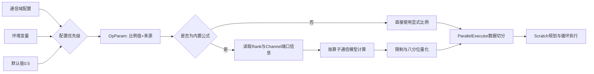

# HCCL ParallelExecutor多维并行数据切分系统设计与验证

## 1. 文档信息

| 项目 | 内容 |
|---|---|
| 特性/模块 | HCCL ParallelExecutor多维并行数据切分 |
| 作者 | weixin_43960572（yuantangzhi@huawei.com） |
| 涉及算子 | AllReduce、AllGather、ReduceScatter、Broadcast、Reduce |
| 主要实现 | `46dcb41e`，MR !1302 |
| 关键问题闭环 | `e8cf7ab9`，MR !1739 |
| 特性资料 | `a7d3a736`，MR !1423 |
| 验证类型 | 系统设计检查、兼容性检查、边界分析、代码路径验证 |

## 2. 摘要

HCCL两维度并行通信算法将每轮数据拆分到两条互补路径：数据片0先执行Server内Mesh通信、再执行Server间NHR/Clos通信；数据片1则先执行Server间通信、再执行Server内通信。两条路径并行执行时，切分比例直接影响负载均衡、Scratch空间布局和最终通信效率。

本设计将原有固定比例扩展为“通信域配置、环境变量、内置公式”三级配置体系，并根据Rank规模、Channel端口规模和算子通信模型自动计算切分比例。方案覆盖Host侧配置解析、HCOMM动态接口兼容、Device侧公共计算以及五类ParallelExecutor接入。

系统设计验证识别出一个已经闭环的关键问题：动态数据分片与静态Scratch布局使用了不一致的对齐规则，在Broadcast最后一轮回退场景下会造成Scratch区间重叠和数据损坏。验证还识别出两个需要后续闭环的问题：通信域配置将`0.0`解释为“未配置”，而环境变量及用户资料将`0.0`视为合法比例，存在同值不同义风险；AllGather实现已将比例顺序调整为`[R, 1-R]`，但用户资料仍描述为`[1-R, R]`，存在实现与资料不一致风险。

## 3. 背景与目标

### 3.1 背景

两维度并行算法同时利用Server内和Server间通信资源。设每轮待处理数据量为`D`，切分比例为`R`：

- 数据片0大小约为`R × D`，通信路径为Mesh → NHR/Clos。
- 数据片1大小约为`(1 - R) × D`，通信路径为NHR/Clos → Mesh。

固定使用`R=0.5`实现简单，但无法适配不同Rank规模、端口配置、组网形态和算子通信量模型。当两条路径单位数据处理时间差异较大时，平均切分会造成一条路径提前结束、另一条路径成为关键路径，不能充分发挥并行通信能力。

### 3.2 设计目标

1. 支持通信域、环境变量和内置公式三种比例来源，并定义稳定、可诊断的优先级。
2. 在未显式配置时，根据拓扑与算子模型自动计算比例。
3. 保持HCCL与HCOMM独立编译、独立演进，不引入HCOMM私有头文件或编译期硬依赖。
4. 统一AllReduce、AllGather、ReduceScatter、Broadcast、Reduce五类执行器的接入方式。
5. 对空Channel、零Rank、零端口、整数溢出、NaN和Inf等异常输入提供确定性回退。
6. 保证数据切分、Scratch空间规划和快速下发上下文保存使用一致的边界条件。

### 3.3 非目标

- 本特性不负责选择是否进入两维度并行算法。
- 本特性不改变Mesh、NHR/Clos算法模板内部通信语义。
- 本文不提供缺少原始记录支撑的性能提升百分比；性能收益需以目标组网实测为准。

## 4. 架构约束

该方案遵循HCCL仓的以下架构约束：

| 约束 | 设计响应 |
|---|---|
| 上层依赖下层 | 配置和拓扑信息由HCCL算子侧消费，不要求HCOMM反向依赖HCCL |
| 控制面/数据面分离 | Host侧完成配置和拓扑信息准备，Device侧执行数据切分与算法编排 |
| HCCL与HCOMM解耦 | 通信域配置查询通过现有dlsym符号表访问，不直接依赖HCOMM私有实现 |
| 独立版本演进 | 同时检查编译期枚举能力和运行时函数符号，旧版本自动降级 |

## 5. 系统设计

### 5.1 总体流程



设计不仅传递比例值，还通过`MultipleDimensionSplitRatioSource`保存比例来源：

- `COMM_CONFIG`：通信域显式配置。
- `ENV_CONFIG`：环境变量显式配置。
- `BUILTIN_FORMULA`：未显式配置，由Device侧结合实际拓扑计算。

来源字段避免了“默认值0.5”和“用户显式配置0.5”无法区分的问题，使执行器只在`BUILTIN_FORMULA`场景调用内置公式。

### 5.2 三级配置优先级

配置优先级定义为：

```text
通信域配置 > HCCL_ALG_MULTIPLE_DIMENSION_SPLIT_RATIO > 内置公式
```

Host侧在算子选择阶段完成来源判定，并将比例值和来源写入`OpParam::opConfig`。这样可以保证同一通信域的精细化配置覆盖进程级环境变量，同时保留环境变量作为调试和调优入口。

异常处理策略如下：

| 场景 | 行为 |
|---|---|
| HCOMM头文件不包含对应配置枚举 | 跳过通信域查询，降级到环境变量或内置公式 |
| 运行时不存在`HcclConfigGetInfo`符号 | 跳过通信域查询，保持旧版本可运行 |
| 通信域接口返回不支持 | 视为未配置并降级 |
| 通信域比例非有限或越界 | 返回参数错误，阻止错误配置继续执行 |
| 环境变量比例非有限或越界 | 告警并回退到`0.5` |
| 没有显式配置 | 标记为`BUILTIN_FORMULA`，由执行器按拓扑计算 |

### 5.3 HCOMM跨版本兼容

通信域配置能力存在“编译时头文件版本”和“运行时HCOMM库版本”两个兼容维度，仅检查其中一个维度都不充分：

1. 使用SFINAE检测`HcclConfigType`是否包含切分比例枚举。旧头文件不具备枚举时，不实例化通信域查询分支。
2. 枚举存在时，再检查dlsym符号表中的`dlHcclConfigGetInfo`是否有效。
3. 只有编译期和运行时能力同时满足时，才查询通信域配置。

该机制避免了新HCCL代码对旧HCOMM头文件或运行库形成硬依赖，符合两仓解耦约束。

### 5.4 内置公式

内置公式先从首个非空Channel组提取端口规模，并结合Rank规模计算两侧单位数据时间系数。设：

- `P0`：Server内Rank数。
- `P1`：Server间Rank数。
- `B0`：Server内端口和经`(P0-1)`扩展后的有效端口规模。
- `B1`：Server间端口和经POD修正后的有效端口规模。
- `Tm`：Mesh侧单位数据时间系数。
- `Tc`：Clos侧单位数据时间系数。

原始切分比例为：

```text
Rraw = Tc / (Tc + Tm)
```

不同算子的通信量模型不同，因此不能共用同一组时间系数：

| 模型 | 使用算子 | Mesh侧时间系数 | Clos侧时间系数 |
|---|---|---|---|
| `REDUCE_SCATTER_WITH_LOCAL_REDUCE` | AllReduce、ReduceScatter、Reduce | `21(P0-1)/(20×P0×B0)` | `(P1-1)/(P1×B1)` |
| `SCATTER` | Broadcast | `(P0-1)/(P0×B0)` | `(P1-1)/(P1×B1)` |
| `ALL_GATHER` | AllGather | `(P0-1)/B0` | `(P1-1)/B1` |

针对双Die POD链路，设计根据首个有效Server间Channel组的Die信息识别POD形态，并对Server间有效端口规模执行2:1收敛修正。

公式结果还需经过以下处理：

1. 校验分母和结果必须为有限值且处于`[0,1]`。
2. 按就近原则量化到`1/8`至`7/8`的八分位候选值，减少碎片化比例。
3. AllGather根据实测经验将比例上限限制为`0.5`。
4. 任一输入或计算异常时，返回规范化后的回退值并记录原因和拓扑参数。

### 5.5 执行器接入

| 执行器 | 计算模型 | 切分结果 |
|---|---|---|
| `InsAllReduceParallelExecutor` | `REDUCE_SCATTER_WITH_LOCAL_REDUCE` | `R`与`1-R` |
| `InsReduceScatterParallelExecutor` | `REDUCE_SCATTER_WITH_LOCAL_REDUCE` | `R`与`1-R` |
| `ReduceParallelExecutor` | `REDUCE_SCATTER_WITH_LOCAL_REDUCE` | `R`与`1-R` |
| `InsBroadcastParallelExecutor` | `SCATTER` | `R`与`1-R` |
| `InsV2AllGatherParallelExecutor` | `ALL_GATHER` | `R`与`1-R`，统一为先Mesh后Clos的表达顺序 |

各执行器只负责保存来源、调用公共计算接口并将比例用于Scratch规划和每轮数据切分；输入校验、公式计算、量化和回退集中在公共模块中，避免五套实现产生行为漂移。

## 6. 系统设计验证

### 6.1 验证方法

本次验证采用以下方法：

1. 架构约束检查：检查跨仓依赖方向及dlsym调用方式。
2. 配置决策表检查：覆盖三种来源、接口不支持和非法输入。
3. 公式边界分析：覆盖零值、空集合、溢出和非有限值。
4. 执行路径检查：核对五类执行器的模型映射及切分方向。
5. Scratch区间不变量分析：验证动态切分结果不能突破静态空间规划边界。
6. 资料一致性检查：核对环境变量范围、算子语义和使用约束。

### 6.2 验证结果

| 编号 | 验证项 | 结果 | 结论 |
|---|---|---|---|
| V1 | 通信域、环境变量、内置公式优先级 | 已形成唯一决策链，并记录比例来源 | 通过 |
| V2 | 旧HCOMM头文件兼容 | 无配置枚举时由SFINAE跳过查询分支 | 通过 |
| V3 | 旧HCOMM运行库兼容 | dlsym符号不存在时自动降级 | 通过 |
| V4 | 非法比例与非有限值 | 通信域拒绝，环境变量回退，公式结果统一校验 | 通过，但错误策略需在接口规范中持续保持一致 |
| V5 | 零Rank、空Channel、零端口及乘法溢出 | 返回回退比例并输出诊断日志 | 通过 |
| V6 | 五类执行器模型映射 | 按ReduceScatter、Scatter、AllGather三类模型接入 | 通过 |
| V7 | 动态切分与Scratch空间一致性 | 发现Broadcast最后一轮Scratch重叠问题并完成修复 | 问题已闭环 |
| V8 | 特性资料 | 已输出功能、语义、约束和配置示例，但AllGather比例顺序未随!1302同步 | 不通过，待闭环 |
| V9 | 性能收益 | 当前三个PR未保留可引用的完整组网与性能数据 | 待补充 |

上述“通过”表示设计和代码路径具备对应处理机制，不替代硬件环境上的性能测试、长稳测试和完整CI报告。

## 7. 关键系统设计问题

### 7.1 已闭环：动态分片与静态Scratch布局的对齐不一致

#### 问题现象

Broadcast ParallelExecutor提前按`AICPU_ALIGN_SIZE`向下对齐静态`sliceCountPart0`，并据此计算`InterStage0`和`IntraStage1`的Scratch偏移。原循环仅在`remainingLoopTimes > 1`时对当前分片对齐；最后一轮可能保留未对齐的`currCountPart0`。

当最后一轮满足：

```text
currCountPart0 > sliceCountPart0
```

则同一步内可能出现：

```text
Intra0使用区间：[0, currCountPart0)
Inter1使用区间：[sliceCountPart0, ...)
```

两个区间发生重叠，最终造成数据损坏。

#### 根因

这不是单一数组越界问题，而是两个模块对同一边界条件采用了不同假设：

- Scratch规划模块假设数据片0已经完成对齐。
- 动态循环模块假设最后一轮无需对齐。

二者分别看都具备局部合理性，但组合后破坏了“动态分片不得超过静态Scratch分区”的系统不变量。

#### 解决方案

MR !1739增加`currCountPart0 > sliceCountPart0`触发条件。当最后一轮分片可能突破静态边界时仍执行对齐，保证：

```text
currCountPart0 <= sliceCountPart0
```

同时：

- 使用`currProcessedCount`统一记录本轮实际进度，防止零进度循环。
- 仅当实际只有一轮完整处理、使用CCU且非OFFLOAD时保存FastLaunch上下文，避免回退产生额外迭代后误用单轮上下文。

#### 验证结论

修复重新建立了数据切分、Scratch规划和FastLaunch之间的共同不变量，修改范围集中在一个执行器文件，属于小范围、可审查的系统性补丁。

### 7.2 待确认：比例`0.0`在不同配置源中的语义不一致

用户资料声明比例合法范围为`[0,1]`，环境变量路径也接受`0.0`；但通信域配置查询将`commRatio == 0.0`解释为“未配置”，随后降级到环境变量或内置公式。

这会产生以下风险：

- 用户通过通信域显式配置`0.0`时，实际行为不是使用`0.0`。
- 同一个数值在通信域和环境变量两个来源中含义不同。
- 日志虽然记录了来源，但上层难以仅从配置值判断最终行为。

建议后续选择一种方式统一语义：

1. HCOMM配置接口返回独立的“是否配置”状态，不使用数值哨兵。
2. 若通信域明确不支持`0.0`，则将接口和用户资料范围统一为`(0,1]`。
3. 增加通信域`0.0`、环境变量`0.0`及优先级组合用例，固化预期行为。

### 7.3 待闭环：AllGather比例顺序与用户资料不一致

MR !1423的用户资料说明：

```text
AllGather数据片0 = 1-R，路径为Mesh → NHR
AllGather数据片1 = R，路径为NHR → Mesh
```

MR !1302随后修改`InsV2AllGatherParallelExecutor::GetParallelDataSplit`，当前实现为：

```text
splitDataSize[0] = R，日志字段为meshFirstRatio
splitDataSize[1] = 1-R，日志字段为closFirstRatio
```

实现调整后，用户资料未同步更新。该问题会导致：

- 用户按照资料调整环境变量时，实际调节的是相反的数据片。
- “路径较慢时调大还是调小`R`”的调优建议可能完全反向。
- 现场性能问题定位时，日志、代码和资料无法形成一致证据链。

建议将代码行为作为当前事实基线，确认AllGather顺序调整是否为最终设计；确认后同步修改用户资料、示意图和配置示例，并增加文档与执行器映射的一致性评审项。

## 8. 特性资料输出

MR !1423新增`HCCL_ALG_MULTIPLE_DIMENSION_SPLIT_RATIO`说明文档及示意图，覆盖：

- 两维度并行通信的两条执行路径。
- AllGather与ReduceScatter切分语义的差异。
- 配置范围、默认值和异常行为。
- 数据类型、对齐及尾块对实际比例的影响。
- 生效条件、调优建议和产品支持范围。

该资料将内部算法设计转换为用户可理解、可操作的配置说明，是本特性从实现到交付闭环的一部分。但系统验证发现，!1302修改AllGather比例顺序后资料未同步，因此当前资料产出事实成立，内容一致性仍需补充闭环。

## 9. 结论与后续计划

本方案完成了ParallelExecutor多维并行切分从固定配置到“显式配置+拓扑公式”的系统化演进，建立了跨版本兼容、分模型计算、公共异常回退及多执行器统一接入机制。

设计验证的主要结论如下：

1. 配置、计算和执行职责边界清晰，符合HCCL/HCOMM解耦要求。
2. 三类通信量模型避免了不同算子错误共用同一公式。
3. 边界防护覆盖空拓扑、零值、溢出及非有限数值。
4. 验证识别并闭环了动态分片与静态Scratch规划不一致造成的数据损坏问题。
5. 验证识别出通信域`0.0`哨兵与公开取值范围不一致的待确认问题。
6. 验证识别出AllGather比例顺序在实现与用户资料之间不一致的待闭环问题。

建议继续补充：

- 针对公式和配置优先级的UT。
- 覆盖单轮、多轮、尾块、4KB边界和Fallback场景的ST。
- 不同Rank规模、端口配置和数据量下的性能对比数据。
- 通信域`0.0`配置语义的接口决策及回归用例。
- 同步AllGather比例顺序的用户资料、示意图及一致性用例。

## 10. 证据索引

| 证据 | 内容 | 作用 |
|---|---|---|
| `46dcb41e` / MR !1302 | 三级配置、内置公式、兼容机制、五类执行器接入 | 系统设计与实现主证据 |
| `e8cf7ab9` / MR !1739 | Broadcast最后一轮Scratch重叠修复 | 关键设计问题识别与闭环证据 |
| `a7d3a736` / MR !1423 | 环境变量说明文档及示意图 | 特性资料输出证据 |

> 证据边界：本文基于仓库提交、MR描述及代码路径整理。静态检查报告、CI记录、硬件测试日志和性能数据应作为附件单独补充，不在缺少原始记录时推定为已完成。
