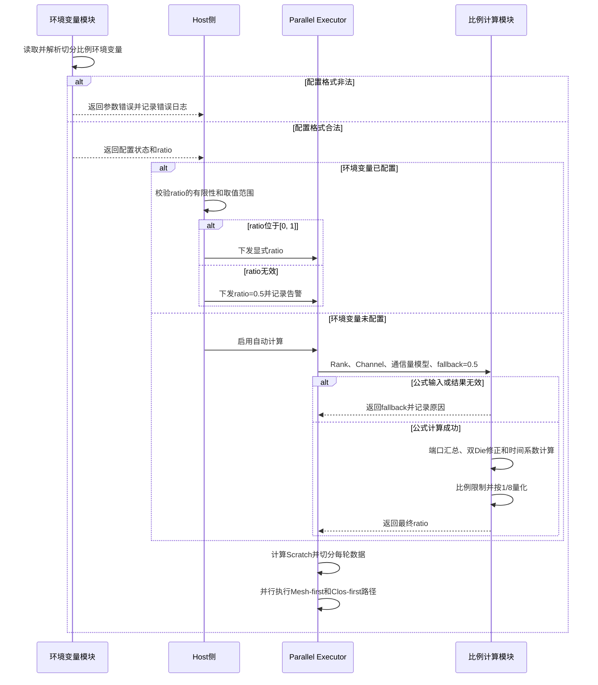

# 1. [HCCL] Parallel算法数据切分比例配置与自动计算需求SRS

## 1.1 介绍

Parallel算法将输入数据切分为两部分，并通过以下两条路径并行执行，以同时利用Server内和Server间的通信能力：

- 第一部分数据按先Mesh、后Clos的顺序执行，称为Mesh-first路径。
- 第二部分数据按先Clos、后Mesh的顺序执行，称为Clos-first路径。

原有Parallel算法主要使用固定比例切分数据，无法根据Server内外Rank规模和链路端口能力动态适配。在不同拓扑下，两条路径处理等量数据所需的时间可能不同，固定比例会造成其中一条路径提前完成、另一条路径成为性能瓶颈。

本需求为Parallel算法提供以下两种数据切分方式：

1. 用户通过环境变量显式指定Mesh-first路径的数据比例，用于性能调优和问题定位。
2. 用户未配置环境变量时，根据Server内外Rank数、Channel端口规模和算子通信量模型自动计算切分比例，使两条并行路径的预计处理时间尽量接近。

本需求统一切分比例语义：`ratio`表示Mesh-first路径的数据比例，Clos-first路径的数据比例为`1 - ratio`。

## 1.2 输入

### 1.2.1 用户输入

用户通过以下环境变量显式配置数据切分比例：

```bash
export HCCL_ALG_MULTIPLE_DIMENSION_SPLIT_RATIO=<ratio>
```

| 项目 | 说明 |
| --- | --- |
| 配置项 | `HCCL_ALG_MULTIPLE_DIMENSION_SPLIT_RATIO` |
| 数据类型 | 十进制非负数 |
| 有效范围 | `[0, 1]` |
| 配置含义 | Mesh-first路径的数据比例 |
| `0` | 全部数据分配给Clos-first路径 |
| `1` | 全部数据分配给Mesh-first路径 |
| 未配置 | 启用自动计算 |
| 格式非法 | 按环境变量解析错误处理，返回参数错误并输出错误日志 |
| 数值超出`[0, 1]` | 使用`0.5`作为本次显式切分比例并输出告警，不再执行自动计算 |

### 1.2.2 自动计算输入

用户未配置环境变量时，自动计算使用以下运行时信息：

| 输入 | 含义 |
| --- | --- |
| `intraRankSize` | Server内并行通信层的Rank数 |
| `interRankSize` | Server间并行通信层的Rank数 |
| `intraChannels` | Server内Channel Map |
| `interChannels` | Server间Channel Map |
| `portGroupSize` | Channel对应的端口能力系数 |
| `dieId` | Channel本地Endpoint所属Die，用于识别双Die链路收敛场景 |
| 通信量模型 | 根据算子类型选择ReduceScatter with local reduce、Scatter或AllGather模型 |

## 1.3 处理

HCCL按以下规则处理Parallel算法的数据切分：

1. 初始化阶段解析`HCCL_ALG_MULTIPLE_DIMENSION_SPLIT_RATIO`。
2. 环境变量有效时，直接使用其配置值，不对显式配置值进行八分位量化。
3. 环境变量未配置时，在Executor获得Rank和Channel信息后执行自动计算。
4. 自动计算从Server内外Channel Map中分别选择首个非空Channel组，汇总其`portGroupSize`。
5. 根据Channel数量和`dieId`识别双Die链路收敛场景，并修正Server间有效端口规模。
6. 根据算子通信量模型计算Mesh和Clos两侧处理单位数据的时间系数，进而得到Mesh-first路径的原始比例。
7. 对自动计算结果执行算子专项限制和八分位量化，得到最终切分比例。
8. 自动计算输入异常或计算结果无效时，回退到`0.5`。
9. Executor使用同一个最终比例完成Scratch空间计算、每轮数据切分和两条路径的任务编排。

## 1.4 输出

本需求不新增HCCL对外接口和用户可见返回值。内部输出为一组互补的数据切分比例：

```text
meshFirstRatio = ratio
closFirstRatio = 1 - ratio
```

运行过程中输出比例计算方式、拓扑输入、原始比例、限制后比例、量化比例和异常回退原因等日志，用于性能分析和问题定位。

## 1.5 约束分析

| 支持的算子名称 | AllGather、AllReduce、Broadcast、Reduce、ReduceScatter |
| --- | --- |
| 支持的算法名称 | 上述算子的Parallel算法，包括已注册的Mesh1D/NHR组合 |
| 支持的芯片类型 | A5 |
| 支持的展开模式 | AICPU、CCU |
| 支持的拓扑形态 | 沿用各Parallel Executor已注册的Multilevel、UBX、PcieMix、Squeeze2D等拓扑；自动计算要求能够获得有效的Server内外Rank和Channel信息 |
| 支持的调用类型 | 不新增限制，沿用对应算子和Parallel算法的原有调用类型 |
| 支持的数据类型 | 不新增限制，沿用对应算子的原有数据类型范围 |
| 支持的数据量 | 不新增限制；实际分片仍需满足Executor现有对齐、Scratch和单轮最大数据量约束 |
| 是否支持绕路 | 不新增或改变绕路能力，沿用原Parallel算法约束 |
| 是否支持确定性计算 | 不改变算子计算结果和归约顺序约束，沿用原Parallel算法能力 |

其他约束如下：

1. `ratio`始终表示Mesh-first路径比例，所有接入的Executor必须使用相同语义。
2. 环境变量显式配置允许取边界值`0`和`1`。
3. 自动计算的正常结果量化到`1/8`至`7/8`之间，避免任一路径完全没有数据。
4. AllGather自动计算比例不超过`0.5`。
5. 自动计算依赖的拓扑信息异常时不得导致除零、整数溢出、非有限值参与分片或进程崩溃。
6. 本需求仅影响选中Parallel Executor后的数据切分，不改变算子算法选择结果。

## 1.6 验收标准

1. 设置合法环境变量后，五类Parallel Executor均直接使用配置值作为Mesh-first比例，Clos-first比例为`1 - ratio`。
2. 环境变量未配置时，五类Parallel Executor根据对应通信量模型自动计算比例。
3. 自动计算正常完成时，结果为`0.125`、`0.25`、`0.375`、`0.5`、`0.625`、`0.75`或`0.875`之一；AllGather结果不超过`0.5`。
4. `intraRankSize`或`interRankSize`为0、Channel Map为空、没有非空Channel组、端口规模为0、计算溢出或结果非有限时，比例回退为`0.5`并输出原因日志。
5. 满足双Die链路识别条件时，Server间有效端口规模按2:1收敛关系修正；`dieId`不可用时不执行该修正。
6. AllGather的数据切分顺序与其他Parallel Executor保持一致，第一部分为Mesh-first，第二部分为Clos-first。
7. Reduce的Scratch计算和逐轮数据切分使用同一个最终比例，不得分别使用配置值和公式值。
8. 环境变量格式非法时按现有环境变量错误流程返回参数错误；数值超出`[0, 1]`时使用`0.5`并输出告警。
9. 本需求不改变非Parallel算法的执行行为和集合通信计算结果。

# 2. [HCCL] Parallel算法数据切分比例配置与自动计算需求SD

## 2.1 功能描述

本设计在Host侧完成环境变量解析和切分模式判定，在Parallel Executor侧完成自动公式计算和实际数据切分。

环境变量已配置时，Host侧将比例及显式配置状态随算子参数传递给Executor，Executor直接使用配置值。环境变量未配置时，Executor使用已经获取的层级Rank和Channel资源调用公共公式，根据当前算子的通信量模型计算最终比例。

公共公式负责以下处理：

- 提取Server内外首个非空Channel组的端口规模。
- 识别并修正双Die链路的2:1收敛关系。
- 按算子模型计算Mesh和Clos时间系数。
- 计算Mesh-first原始比例。
- 执行AllGather上限限制和八分位量化。
- 对异常输入、溢出和非有限结果执行统一回退。

最终比例同时用于Scratch资源预算和Executor数据切分，确保资源计算与执行阶段使用一致的切分结果。

## 2.2 流程描述



环境变量配置流程和自动计算流程互斥：只要环境变量被成功解析为数值，即按显式配置处理；超出有效范围时使用`0.5`，不会转入自动公式。

## 2.3 数据描述

### 2.3.1 环境变量配置数据

环境变量解析状态保存在算法环境配置中：

| 数据 | 类型 | 含义 |
| --- | --- | --- |
| `multipleDimensionSplitRatioSet` | `bool` | 是否成功解析到环境变量配置 |
| `multipleDimensionSplitRatio` | `double` | 环境变量中的切分比例 |

环境变量使用现有线程局部配置和互斥保护机制读取。算子参数中保存最终配置值及当前是否需要自动计算的内部状态，供Executor使用。

### 2.3.2 Channel数据

| 字段 | 类型 | 含义 |
| --- | --- | --- |
| `portGroupSize` | `u32` | Channel端口能力系数，用于计算两层通信的单位数据处理时间 |
| `dieId` | `u32` | 本地Endpoint所属Die；无法获取时取无效Rank ID |

`dieId`获取失败不阻断建链和算子执行，仅表示该Channel不能用于双Die链路收敛识别。

### 2.3.3 数据切分类型

公共公式使用`ParallelDataSplitType`区分三类通信量模型：

| 枚举值 | 使用算子 | 含义 |
| --- | --- | --- |
| `REDUCE_SCATTER_WITH_LOCAL_REDUCE` | AllReduce、Reduce、ReduceScatter | ReduceScatter通信并包含本地归约开销 |
| `SCATTER` | Broadcast | Scatter阶段的通信量模型 |
| `ALL_GATHER` | AllGather | AllGather阶段的通信量模型 |

### 2.3.4 端口规模计算

定义：

```text
M = intraRankSize
C = interRankSize
Pintra = intraChannels首个非空Channel组的portGroupSize之和
Pinter = interChannels首个非空Channel组的portGroupSize之和
A = Pintra × (M - 1)
```

Server间首个非空Channel组同时满足以下条件时，认为存在双Die链路2:1收敛：

1. Channel组恰好包含两条Channel。
2. 两条Channel的`dieId`均有效。
3. 两条Channel的`dieId`不同。

有效Server间端口规模定义为：

```text
B = Pinter / 2，满足双Die链路识别条件
B = Pinter，其他情况
```

公式只使用Map中首个非空Channel组，保证所选端口组与当前Parallel层级的一组实际通信资源对应。

### 2.3.5 时间系数和原始比例

各模型的单位数据时间系数如下：

| 通信量模型 | Mesh时间系数`Tmesh` | Clos时间系数`Tclos` |
| --- | --- | --- |
| ReduceScatter with local reduce | `21 × (M - 1) / (20 × M × A)` | `(C - 1) / (C × B)` |
| Scatter | `(M - 1) / (M × A)` | `(C - 1) / (C × B)` |
| AllGather | `(M - 1) / A` | `(C - 1) / B` |

为使两条路径的预计处理时间接近，Mesh-first原始比例计算为：

```text
rawRatio = Tclos / (Tclos + Tmesh)
```

该公式满足：某一侧单位数据处理时间越长，分配给以该侧作为第一阶段的路径的数据越少。

### 2.3.6 比例限制和量化

AllGather在自动计算场景下先执行上限限制：

```text
limitedRatio = min(rawRatio, 0.5)
```

其他模型：

```text
limitedRatio = rawRatio
```

随后按最接近的八分位进行量化，并将量化索引限制到`[1, 7]`：

```text
ratioIndex = round(limitedRatio × 8)
ratioIndex = max(1, min(ratioIndex, 7))
finalRatio = ratioIndex / 8
```

环境变量显式配置值不经过上述上限限制和量化。

### 2.3.7 回退规则

自动计算的回退比例默认为`0.5`。公共公式先对调用方传入的回退值执行归一化：有限值限制到`[0, 1]`，非有限值改为`0.5`。

以下情况返回回退比例：

| 异常场景 | 回退原因 |
| --- | --- |
| `intraRankSize == 0` | Server内Rank数无效 |
| `interRankSize == 0` | Server间Rank数无效 |
| Server内或Server间Channel Map为空 | 缺少公式输入 |
| Channel Map中不存在非空Channel组 | 无法提取端口规模 |
| Server内或Server间端口规模为0 | 公式存在除零风险 |
| `Pintra × (M - 1)`发生整数溢出 | 端口规模扩展无效 |
| 扩展后的Server内端口规模为0 | 公式存在除零风险，包括`M == 1`场景 |
| Server间有效端口规模为0或非有限值 | 公式输入无效 |
| 数据切分类型未知 | 无法选择通信量模型 |
| `Tclos + Tmesh`为0或非有限值 | 无法计算比例 |
| 原始比例非有限或不在`[0, 1]` | 计算结果无效 |

回退结果不执行八分位量化。

## 2.4 依赖性描述

1. 依赖现有算法环境变量初始化流程解析并保存`HCCL_ALG_MULTIPLE_DIMENSION_SPLIT_RATIO`。
2. 依赖Parallel Executor已经完成的层级Rank信息和Channel Map构建，不新增拓扑查询流程。
3. 依赖Channel资源提供`portGroupSize`；缺失或为0时自动回退。
4. 双Die链路修正依赖Endpoint的`dieId`属性；属性不可用时保留原始Server间端口规模。
5. 依赖Host侧将切分配置及自动计算状态随算子参数传递到AICPU或CCU执行路径。
6. 不新增HCCL公开头文件接口，不改变`include/hccl.h`和`include/hccl_mc2.h`。
7. 公式实现使用C++14标准库能力，包括`std::isfinite`、`std::round`、`std::min`和`std::max`。

## 2.5 接口描述

### 2.5.1 获取环境变量比例

| 项目 | 说明 |
| --- | --- |
| 函数原型 | `bool GetExternalInputMultipleDimensionSplitRatio(double &multipleDimensionSplitRatio)` |
| 函数功能 | 获取已经解析的环境变量切分比例 |
| 输入说明 | `multipleDimensionSplitRatio`为输出引用 |
| 输出说明 | 环境变量已配置时写入解析后的比例 |
| 返回值说明 | `true`表示已配置；`false`表示未配置，应启用自动计算 |

### 2.5.2 提取端口规模

| 项目 | 说明 |
| --- | --- |
| 函数原型 | `bool GetPortGroupSize(const std::map<u32, std::vector<ChannelInfo>> &channels, uint64_t &portGroupSize)` |
| 函数功能 | 查找首个非空Channel组并累加其中所有Channel的`portGroupSize` |
| 输入说明 | `channels`为某一通信层的Channel Map |
| 输出说明 | `portGroupSize`返回端口规模之和；调用开始时清零 |
| 返回值说明 | 找到非空Channel组返回`true`，否则返回`false` |

### 2.5.3 自动计算切分比例

| 项目 | 说明 |
| --- | --- |
| 函数原型 | `double CalcParallelDataSplitRatio(uint64_t intraRankSize, uint64_t interRankSize, const std::map<u32, std::vector<ChannelInfo>> &intraChannels, const std::map<u32, std::vector<ChannelInfo>> &interChannels, ParallelDataSplitType splitType, double fallbackRatio)` |
| 函数功能 | 根据Rank、Channel端口规模和通信量模型计算Mesh-first比例 |
| 输入说明 | Server内外Rank数、Channel Map、切分类型和异常回退比例 |
| 输出说明 | 正常场景返回限制和量化后的比例，异常场景返回归一化后的回退比例 |
| 返回值说明 | `double`，范围为`[0, 1]` |

### 2.5.4 Executor数据切分接口

| 项目 | 说明 |
| --- | --- |
| 函数原型 | 各Parallel Executor的`GetParallelDataSplit`成员函数 |
| 函数功能 | 根据显式配置状态决定直接使用环境变量比例或调用自动计算公式 |
| 输入说明 | Executor内部保存的Rank、Channel、切分配置和算子模型 |
| 输出说明 | 输出`meshFirstRatio`及`closFirstRatio`，或返回Mesh-first比例 |
| 返回值说明 | AllGather、AllReduce、Broadcast、ReduceScatter通过容器输出；Reduce返回`double` |

## 2.6 约束分析

| 支持的算子名称 | AllGather、AllReduce、Broadcast、Reduce、ReduceScatter |
| --- | --- |
| 支持的算法名称 | 对应算子的Parallel Executor，不扩展到Sequence、Concurrent、Sole等其他Executor |
| 支持的芯片类型 | A5 |
| 支持的展开模式 | AICPU、CCU |
| 支持的拓扑形态 | 沿用Parallel Executor当前注册范围；公式要求Server内外两层Rank和Channel信息 |
| 支持的调用类型 | 沿用各算子现有能力 |
| 支持的数据类型 | 沿用各算子现有能力，比例计算与数据类型无关 |
| 支持的数据量 | 沿用各Executor现有分片和Scratch上限 |
| 是否支持绕路 | 沿用原Parallel算法能力 |
| 是否支持确定性计算 | 不改变原有确定性语义 |

实现约束：

1. 所有Executor的第一份数据必须统一表示Mesh-first路径，禁止再次交换AllGather两份数据的比例顺序。
2. 自动公式必须在Rank和Channel资源准备完成后调用。
3. 同一轮执行的Scratch计算和实际分片必须使用同一个最终比例。
4. 端口规模累加和Rank扩展使用`uint64_t`并在乘法前检查溢出。
5. 任何外部输入和浮点计算结果进入分片计算前必须执行有限值和范围检查。
6. 比例计算失败属于可回退异常，不应中断集合通信任务。

## 2.7 DFX设计

| 校验内容 | 级别 | 搜索内容 |
| --- | --- | --- |
| 环境变量数值超出范围 | WARNING | `[SetMultipleDimensionSplitRatio] env ratio`、`out of range` |
| 自动计算输入或结果异常 | WARNING | `[CalcParallelDataSplitRatio] fallback due to` |
| 自动计算正常完成 | INFO | `[CalcParallelDataSplitRatio] intraRankSize`、`quantizedRatio` |
| Executor最终切分比例 | INFO | `meshFirstRatio`、`closFirstRatio` |

测试用例通过上述日志关键字判断配置校验、公式计算、异常回退和最终比例是否符合预期。

## 2.8 资料描述

需要新增或更新环境变量资料：

1. 新增`docs/zh/user_guide/hccl_env/HCCL_ALG_MULTIPLE_DIMENSION_SPLIT_RATIO.md`，说明配置格式、范围、比例语义、支持范围和未配置时的自动计算行为。
2. 在环境变量索引中增加`HCCL_ALG_MULTIPLE_DIMENSION_SPLIT_RATIO`入口。
3. 资料中明确环境变量比例表示Mesh-first路径，避免与历史AllGather切分顺序混淆。
4. 资料中不展开内部公式的硬件参数细节，仅说明未配置时由HCCL根据拓扑自动选择。

## 2.9 性能&&质量

### 2.9.1 性能目标

1. 自动公式根据Server内外通信能力分配数据，降低两条并行路径完成时间差，减少慢路径对算子总耗时的影响。
2. 环境变量允许性能工程师针对特定拓扑覆盖自动结果，不引入额外的数据搬运路径。
3. 比例计算仅在Executor编排阶段执行一次，计算复杂度与首个非空Channel组中的Channel数线性相关，不进入高频数据搬运循环。
4. AllGather自动比例上限为`0.5`，避免在Server数增加时按纯通信量公式持续增大Mesh-first数据导致性能退化。

### 2.9.2 质量要求

1. 所有公式输入、分母和输出均执行有效性检查。
2. 端口规模扩展具备无符号整数溢出保护。
3. 自动计算失败统一回退，不产生除零、NaN、无穷值和越界比例。
4. 五类Executor使用一致的比例语义和日志字段。
5. AllGather单Rank或空Channel退化场景能够完成本地数据处理，不访问空容器或发起无效通信。
6. 行为变更需覆盖单元测试、Executor集成测试和非Parallel算法回归测试。

## 2.10 编码方案

### 2.10.1 影响范围

| 模块 | 文件 | 主要变更 |
| --- | --- | --- |
| 算子内部参数 | `src/ops/op_common/inc/alg_param.h` | 统一默认比例为`0.5`；保存比例使用方式；`ChannelInfo`补充`dieId` |
| 环境变量与算子参数 | `src/common/alg_env_config.cc`、`src/common/alg_env_config.h`、`src/ops/op_common/op_common.cc` | 复用环境变量解析结果，校验比例并向Executor传递显式配置或自动计算状态 |
| 公式公共能力 | `src/ops/op_common/template/template_utils.cc`、`src/ops/op_common/template/template_utils.h` | 新增端口提取、模型枚举、公式计算、量化、回退和日志 |
| Channel属性 | `src/ops/op_common/op_common.cc` | 获取Endpoint的`dieId`并写入`ChannelInfo`，失败时保留无效值 |
| AllGather Parallel | `src/ops/all_gather/executor/ins_v2_all_gather_parallel_executor.cc/.h` | 接入AllGather模型，统一Mesh-first/Clos-first顺序 |
| AllGather NHR模板 | `src/ops/all_gather/template/aicpu/ins_temp_all_gather_nhr.cc` | 处理空Channel和单Rank退化场景 |
| AllReduce Parallel | `src/ops/all_reduce/executor/ins_v2_all_reduce_parallel_executor.cc/.h` | 接入ReduceScatter with local reduce模型 |
| Broadcast Parallel | `src/ops/broadcast/executor/ins_v2_broadcast_parallel_executor.cc/.h` | 接入Scatter模型，覆盖普通编排和CCU快速下发 |
| Reduce Parallel | `src/ops/reduce/executor/reduce_parallel_executor.cc/.h` | 保存最终比例，并统一用于Scratch和逐轮数据切分 |
| ReduceScatter Parallel | `src/ops/reduce_scatter/executor/ins_reduce_scatter_parallel_executor.cc/.h` | 接入ReduceScatter with local reduce模型 |

### 2.10.2 实现步骤

1. 统一比例语义和默认值
   - 内部配置和Executor成员默认比例统一为`0.5`。
   - 明确比例表示Mesh-first路径，第二份数据固定使用`1 - ratio`。

2. 解析和传递环境变量
   - 复用`ParseMultipleDimensionSplitRatio`和`GetExternalInputMultipleDimensionSplitRatio`。
   - 对显式配置值执行有限值和`[0, 1]`范围检查。
   - 环境变量未配置时向Executor传递自动计算状态。

3. 补充Channel属性
   - 建链阶段保留现有`portGroupSize`填充。
   - 查询本地Endpoint的`dieId`并保存到`ChannelInfo`。
   - `dieId`查询失败只记录告警，不影响Channel资源获取。

4. 实现公共公式
   - 从Server内外Channel Map提取首个非空Channel组的端口规模。
   - 检查Rank、Channel、端口规模和乘法溢出。
   - 识别双Die链路并修正Server间有效端口规模。
   - 根据`ParallelDataSplitType`计算Mesh和Clos时间系数。
   - 计算原始比例、执行AllGather上限限制并按八分位量化。
   - 统一处理回退和日志。

5. 接入五类Executor
   - 显式配置状态下直接使用环境变量比例。
   - 自动计算状态下传入各Executor的Rank、Channel Map和通信量模型。
   - 使用最终比例计算Scratch、单轮最大数据量和每轮两部分数据大小。
   - AllGather将第一份数据调整为Mesh-first路径。
   - Reduce增加成员保存最终比例，避免逐轮切分重新使用初始配置值。

6. 补充AllGather退化场景
   - Channel为空时按单片数据准备本地拷贝。
   - 模板Rank数为1时跳过AllGather网络通信，保留本地拷贝流程。

## 2.11 测试方案

### 2.11.1 环境变量测试

| 用例 | 输入 | 期望结果 |
| --- | --- | --- |
| 未配置 | 不设置环境变量 | 启用自动计算 |
| 下边界 | `0` | Mesh-first比例为0，Clos-first比例为1 |
| 普通小数 | `0.3` | 直接使用0.3和0.7，不执行八分位量化 |
| 中间值 | `0.5` | 两条路径各分配0.5 |
| 上边界 | `1` | Mesh-first比例为1，Clos-first比例为0 |
| 小于下界 | 负数格式 | 环境变量格式校验失败并返回参数错误 |
| 大于上界 | `1.1` | 使用0.5并输出范围告警 |
| 非数字 | `abc` | 环境变量解析失败并返回参数错误 |
| 非有限文本 | `nan`、`inf` | 环境变量格式校验失败，不进入分片计算 |

### 2.11.2 自动公式单元测试

1. 分别构造三类通信量模型，验证原始比例公式、AllGather上限和八分位量化结果。
2. 构造Map前部为空、后部首个Channel组非空的场景，验证只汇总首个非空组。
3. 构造Server间两条Channel、有效且不同`dieId`的场景，验证有效端口规模除以2。
4. 构造Channel数量不等于2、`dieId`相同或无效的场景，验证不执行双Die修正。
5. 覆盖Rank数为0、Server内Rank数为1、Map为空、组为空、端口规模为0和端口扩展溢出，验证统一回退`0.5`。
6. 传入非有限回退值，验证回退结果归一化为`0.5`。
7. 验证正常自动结果只落在`[1/8, 7/8]`的八分位集合中。

### 2.11.3 Executor集成测试

1. 对AllGather、AllReduce、Broadcast、Reduce和ReduceScatter分别选择Parallel算法，验证日志中的模型和最终比例正确。
2. 分别覆盖AICPU和CCU已注册的Parallel执行路径。
3. 使用同一拓扑对比环境变量显式配置和未配置场景，确认前者直接生效、后者使用公式。
4. 验证两部分数据量之和始终等于当前轮输入数据量，对齐处理后不存在数据丢失或重复。
5. 验证Reduce的Scratch预算和每轮分片使用相同的最终比例。
6. 验证AllGather第一份数据执行先Mesh后Clos，第二份数据执行先Clos后Mesh。
7. 覆盖AllGather空Channel和单Rank场景，确认不崩溃且本地数据正确。

### 2.11.4 回归与性能测试

1. 回归五个算子的非Parallel算法，确认切分功能不改变其行为。
2. 回归环境变量未配置场景下的算子结果正确性和确定性能力。
3. 在典型Multilevel和UBX拓扑上比较固定`0.5`与自动公式的两条路径完成时间及算子总耗时。
4. 覆盖Server内外端口规模不对称、Rank规模变化和双Die链路场景，验证自动比例变化方向符合预期。
5. 对环境变量取`0`和`1`执行边界回归，确认某一分片为0时Executor能够跳过对应任务且结果正确。

## 2.12 风险与规避

| 风险 | 影响 | 规避措施 |
| --- | --- | --- |
| 首个非空Channel组不能代表当前层全部链路能力 | 自动比例与最优值存在偏差 | 明确首组语义，结合典型拓扑性能数据验证；后续扩展时保持接口兼容 |
| `portGroupSize`缺失或为0 | 公式除零或产生无效比例 | 输入校验并回退`0.5` |
| `dieId`获取失败 | 无法识别双Die链路收敛 | 保持原始端口规模并打印告警，不阻断执行 |
| 公式系数不适合特定硬件或拓扑 | 自动比例性能退化 | 保留环境变量显式调优能力，并通过性能基线验证公式适用范围 |
| AllGather比例超过经验最优区间 | Server规模增大时性能下降 | 自动模式限制Mesh-first比例不超过`0.5` |
| 比例量化边界产生跳变 | 相邻拓扑参数得到不同八分位 | 使用确定的`std::round`规则并增加边界单测 |
| 显式配置`0`或`1`导致某一分片为空 | Executor访问空分片或发起无效任务 | 所有模板在执行前检查当前分片数据量，空分片直接跳过 |
| Scratch计算与逐轮切分比例不一致 | Scratch不足或空间浪费 | Executor只保存和使用一次最终比例，资源计算与执行共享该值 |
