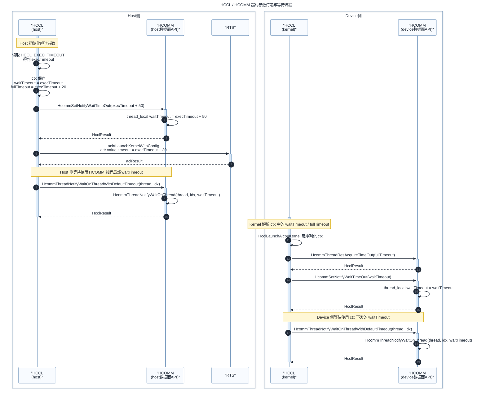

## 1.1 [HCCL] 支持任务超时时间控制需求SRS

### 1.1.1 介绍

AICPU 展开模式下，HCCL 一次通信算子执行链路中存在多个超时点：Host 侧等待 AICPU 通知、RTS 启动 AICPU kernel、Device 侧申请队列/线程资源、Device 侧 notify wait 等。当前部分等待点使用固定超时时间或在调用点显式传入 timeout，无法基于用户配置统一控制，且 HCOMM 新流程已提供默认超时配置接口和不带 timeout 参数的 notify wait 接口。

本需求基于环境变量 `HCCL_EXEC_TIMEOUT` 统一控制 AICPU 场景下的任务执行超时时间，并将同一份超时配置传递到 Host、RTS 和 Device/HCOMM 数据面，使各超时点按梯度生效。新 HCOMM 包上使用 HCOMM 默认超时接口；旧 HCOMM 包上保持现有显式 timeout 调用和现有偏移值，保证 HCCL 可独立编译、运行。

### 1.1.2 输入

用户通过环境变量配置通信算子的执行超时时间：

```bash
export HCCL_EXEC_TIMEOUT=<timeout>
```

配置语义如下：

| 项目 | 说明 |
| --- | --- |
| 配置项 | `HCCL_EXEC_TIMEOUT` |
| 单位 | 秒 |
| 默认值 | 未配置时使用 HCCL 默认执行超时时间 `CUSTOM_TIMEOUT` |
| 取值范围 | 非负数；最终进入 HCOMM/RTS 的取值需落入对应接口类型范围 |
| 取值为 0 | 表示不超时，派生超时点保持 0，不叠加偏移 |
| 非法配置 | 按现有环境变量解析流程上报告警/错误，并回退默认策略 |

### 1.1.3 处理

HCCL 在算子选择和资源准备阶段读取 `HCCL_EXEC_TIMEOUT`，得到统一的 `execTimeout`。AICPU 场景根据 `execTimeout` 派生以下超时时间：

| 超时点 | 生效位置 | 新 HCOMM 流程 | 旧 HCOMM 兼容流程 |
| --- | --- | --- | --- |
| Device notify wait | Device 侧 HCOMM thread-local 默认等待时间 | `waitTimeout = execTimeout`，通过 `HcommSetNotifyWaitTimeOut(waitTimeout)` 设置 | 调用现有带 timeout 参数接口，沿用当前传入值或 `ExecTimeoutManager` |
| Device 队列满/资源申请 | Device 侧 HCOMM 线程/资源申请 | `fullTimeout = execTimeout + 20`，通过 `HcommThreadResAcquireTimeOut(fullTimeout)` 设置 | 不调用新接口，保持旧 HCOMM 行为 |
| AICPU kernel 启动 | Host 侧 `aclrtLaunchKernelWithConfig` | `kernelLaunchTimeout = execTimeout + 30`，并按 RTS 字段范围截断/饱和 | 沿用当前 `KERNEL_TIMEOUT_OFFSET` |
| Host notify wait | Host 侧等待 AICPU 通知 | `hostNotifyTimeout = execTimeout + 50`，通过 `HcommSetNotifyWaitTimeOut(hostNotifyTimeout)` 设置后调用默认等待接口 | 沿用当前 `HOST_NOTIFY_TIMEOUT_OFFSET`，调用带 timeout 参数接口 |

偏移叠加需使用安全加法：当 `execTimeout == 0` 时派生值保持 0；当加法溢出目标类型时按目标类型最大值饱和，并打印告警日志。

### 1.1.4 输出

本需求不新增用户可见输出。运行过程中通过 HCCL 日志输出关键超时配置和实际生效值，用于 DFX 定位。

### 1.1.5 约束分析

| 支持的算子名称 | AICPU 展开模式下使用 HCOMM notify wait 的通信算子 |
| --- | --- |
| 支持的算法名称 | 不限制算法，按 AICPU 数据面调用路径生效 |
| 支持的芯片类型 | A5 |
| 支持的展开模式 | AICPU |
| 支持的拓扑形态 | 不涉及 |
| 支持的调用类型 | 不涉及 |
| 支持的数据类型 | 不涉及 |
| 支持的数据量 | 不涉及 |
| 是否支持绕路 | 不涉及 |
| 是否支持确定性计算 | 不涉及 |

### 1.1.6 验收标准

1. 新 HCOMM 包上，Host/Device 侧均调用 HCOMM 默认超时设置接口，notify wait 调用切换为不带 timeout 参数的新接口。
2. `AlgResourceCtxSerializable` 可将 `waitTimeout`、`fullTimeout` 从 Host 侧序列化并传递到 Device 侧，Device 侧解析值正确。
3. `HCCL_EXEC_TIMEOUT=300` 时，日志中可观察到 `waitTimeout=300`、`fullTimeout=320`、`kernelLaunchTimeout=330`、`hostNotifyTimeout=350`。
4. `HCCL_EXEC_TIMEOUT=0` 时，各派生超时点均保持 0，不被偏移改写为有限超时。
5. 旧 HCOMM 包缺少新接口时，HCCL 仍可编译并运行，行为保持当前仓库中使用的 `HOST_NOTIFY_TIMEOUT_OFFSET` 和 `KERNEL_TIMEOUT_OFFSET` 兼容策略。
6. 非法、越界、溢出配置有明确日志，且不引入崩溃或未定义行为。


## 2.1 [HCCL] 支持任务超时时间控制需求SD

### 2.1.1 功能描述

AICPU 场景整体流程中存在多个超时点，本设计通过 `HCCL_EXEC_TIMEOUT` 建立一套统一的任务超时模型：

- Host 侧负责读取和归一化用户配置，生成 `execTimeout`。
- Host 侧资源上下文新增 `waitTimeout` 和 `fullTimeout`，随 `AlgResourceCtxSerializable` 序列化到 Device 侧。
- Host 侧在 kernel launch 前设置 RTS kernel 启动超时时间。
- Host/Device 侧分别调用 HCOMM 默认超时设置接口，使后续不带 timeout 参数的 notify wait 接口使用线程局部默认值。
- 旧 HCOMM 包未提供新符号时，HCCL 使用弱符号/动态符号检测回退到当前显式 timeout 方案。

### 2.1.2 流程描述

时间控制流程如下图所示：



### 2.1.3 数据描述

#### 2.1.3.1 新增字段

在 `AlgResourceCtxSerializable` 中新增以下字段：

| 字段 | 类型 | 含义 | 填充位置 | 使用位置 |
| --- | --- | --- | --- | --- |
| `waitTimeout` | `u32` | Device 侧 notify wait 默认超时时间 | Host 侧资源准备阶段 | Device 侧调用 `HcommSetNotifyWaitTimeOut` |
| `fullTimeout` | `u32` | Device 侧队列满/资源申请超时时间 | Host 侧资源准备阶段 | Device 侧调用 `HcommThreadResAcquireTimeOut` |

字段需纳入 `Serialize()` 和 `DeSerialize()`。建议放在基础标量字段之后、变长 vector 字段之前，便于阅读和后续维护。该结构仅用于 HCCL Host/Device 内部同包传递，不作为对外 ABI；Host 与 Device 侧代码需同步升级。

#### 2.1.3.2 超时派生规则

```cpp
waitTimeout = execTimeout;
fullTimeout = AddTimeoutOffset(execTimeout, QUEUE_FULL_TIMEOUT_OFFSET);       // +20
kernelLaunchTimeout = AddTimeoutOffset(execTimeout, KERNEL_TIMEOUT_OFFSET);   // +30
hostNotifyTimeout = AddTimeoutOffset(execTimeout, HOST_NOTIFY_TIMEOUT_OFFSET); // +50
```

其中 `AddTimeoutOffset` 规则：

1. `execTimeout == 0` 时返回 0。
2. 非 0 场景执行安全加法。
3. 超出 `uint32_t` 或 RTS `uint16_t` 字段范围时饱和到最大值，并打印 warning。

### 2.1.4 依赖性描述

#### 2.1.4.1 依赖 HCOMM 提供相关接口

1. 支持超时时间配置数据面接口：

```cpp
extern int32_t HcommThreadResAcquireTimeOut(uint32_t timeOut);
extern int32_t HcommSetNotifyWaitTimeOut(uint32_t timeOut);
```

2. 支持以下不带 timeout 的 notify wait 数据面接口：

```cpp
extern int32_t HcommThreadNotifyWaitOnThreadWithDefaultTimeout(ThreadHandle thread, uint32_t notifyIdx);
extern int32_t HcommChannelNotifyWaitOnThreadWithDefaultTimeout(
    ThreadHandle thread, ChannelHandle channel, uint32_t localNotifyIdx);
extern int32_t HcommChannelNotifyWaitWithDefaultTimeout(ChannelHandle channel, uint32_t localNotifyIdx);
```

#### 2.1.4.2 对旧 HCOMM 的兼容处理

上述 HCOMM 接口仅合入 master 主线，旧 HCOMM 包不存在这些接口。为保证 HCCL 独立编译和运行，需要按 `hcomm_primitives_dl.h/.cc` 现有弱符号/动态符号方式处理：

1. 新接口统一通过 HCCL 封装函数调用，不在业务代码中直接调用裸 HCOMM 符号。
2. 初始化 HCOMM 动态符号时记录新接口是否存在。
3. 新接口存在时，使用默认超时接口和不带 timeout 的 notify wait 接口。
4. 新接口不存在时，回退到当前带 timeout 参数的接口：
   - Host 侧 notify wait 使用当前 `HOST_NOTIFY_TIMEOUT_OFFSET`。
   - AICPU kernel launch 使用当前 `KERNEL_TIMEOUT_OFFSET`。
   - Device 侧 notify wait 继续使用当前显式 timeout 传参路径。
   - 不调用 `HcommThreadResAcquireTimeOut` 和 `HcommSetNotifyWaitTimeOut`。
5. 回退路径打印一次性 info 日志，说明当前 HCOMM 不支持默认超时新接口，已启用旧流程兼容。

### 2.1.5 接口描述

#### 2.1.5.1 HCCL 对外接口

不新增 HCCL C API。用户仍通过 `HCCL_EXEC_TIMEOUT` 或已有通信域配置入口控制执行超时时间。若通信域粒度配置与环境变量同时存在，沿用现有优先级：通信域粒度配置优先。

#### 2.1.5.2 HCCL 内部封装接口

建议新增或扩展以下内部封装，屏蔽 HCOMM 新旧包差异：

```cpp
bool IsHcommDefaultTimeoutSupported();

HcclResult HcclSetNotifyWaitTimeOut(uint32_t timeout);
HcclResult HcclThreadResAcquireTimeOut(uint32_t timeout);

HcclResult HcclThreadNotifyWaitOnThreadDefault(
    ThreadHandle thread, uint32_t notifyIdx, uint32_t fallbackTimeout);

HcclResult HcclChannelNotifyWaitOnThreadDefault(
    ThreadHandle thread, ChannelHandle channel, uint32_t localNotifyIdx, uint32_t fallbackTimeout);

HcclResult HcclChannelNotifyWaitDefault(
    ChannelHandle channel, uint32_t localNotifyIdx, uint32_t fallbackTimeout);
```

封装行为：

| 封装函数 | 新 HCOMM 包 | 旧 HCOMM 包 |
| --- | --- | --- |
| `HcclSetNotifyWaitTimeOut` | 调用 `HcommSetNotifyWaitTimeOut` | 返回 `HCCL_E_NOT_SUPPORT` 或直接返回成功并记录未生效，由调用点决定 |
| `HcclThreadResAcquireTimeOut` | 调用 `HcommThreadResAcquireTimeOut` | 返回 `HCCL_E_NOT_SUPPORT` 或直接返回成功并记录未生效 |
| `HcclThreadNotifyWaitOnThreadDefault` | 调用 `HcommThreadNotifyWaitOnThreadWithDefaultTimeout` | 调用 `HcommThreadNotifyWaitOnThread(thread, notifyIdx, fallbackTimeout)` |
| `HcclChannelNotifyWaitOnThreadDefault` | 调用 `HcommChannelNotifyWaitOnThreadWithDefaultTimeout` | 调用 `HcommChannelNotifyWaitOnThread(thread, channel, localNotifyIdx, fallbackTimeout)` |
| `HcclChannelNotifyWaitDefault` | 调用 `HcommChannelNotifyWaitWithDefaultTimeout` | 调用 `HcommChannelNotifyWait(channel, localNotifyIdx, fallbackTimeout)` |

### 2.1.6 使用限制

1. 本需求仅覆盖 A5 AICPU 展开模式。
2. 新 HCOMM 默认超时能力只在包含新接口的 HCOMM 包上生效。
3. 旧 HCOMM 包上不支持队列满/资源申请超时时间的新接口配置，仅保证行为兼容当前流程。
4. `HCCL_EXEC_TIMEOUT=0` 表示不超时，派生超时点不叠加偏移。
5. 若用户设置超大值导致 RTS kernel timeout 字段无法表达，kernel launch timeout 按字段上限饱和，其他 HCOMM 超时按 `uint32_t` 上限饱和。
6. 若后续 HCOMM 明确接口单位不是秒，需要在 HCCL 内部增加统一单位转换函数，并同步更新本设计中的派生规则。

### 2.1.7 DFX 设计

#### 2.1.7.1 日志

在以下位置打印 info/debug 日志，便于确认配置生效：

| 位置 | 日志级别 | 关键字段 |
| --- | --- | --- |
| `SetExecTimeout` | info | `execTimeout`、是否来自环境变量/默认值 |
| AICPU ctx 填充 | info | `waitTimeout`、`fullTimeout` |
| Host 设置 HCOMM 默认超时 | info | `hostNotifyTimeout`、HCOMM 新接口是否支持 |
| AICPU kernel launch | info/debug | `kernelLaunchTimeout` |
| Device 设置 HCOMM 默认超时 | info | `waitTimeout`、`fullTimeout` |
| notify wait 封装 fallback | info，单次 | 当前使用新 HCOMM 默认等待接口或旧 HCOMM 显式 timeout 接口 |

建议日志示例：

```text
[AicpuTimeout] execTimeout[300], waitTimeout[300], fullTimeout[320],
kernelLaunchTimeout[330], hostNotifyTimeout[350], hcommDefaultTimeoutSupported[1].
```

#### 2.1.7.2 告警

以下场景需打印 warning：

1. 派生超时时间加法溢出并发生饱和。
2. `HCCL_EXEC_TIMEOUT` 非法或超出支持范围。
3. 新 HCOMM 包部分接口存在、部分接口缺失，进入旧流程兼容。

### 2.1.8 资料描述

需要同步检查或更新以下资料：

1. `docs/zh/user_guide/hccl_env/HCCL_EXEC_TIMEOUT.md`：补充 A5 AICPU 场景下 Host、kernel、Device 多超时点的生效关系。
2. 故障诊断资料中涉及任务执行超时的章节：补充日志关键字 `AicpuTimeout` 的检索方式。

### 2.1.9 性能 && 质量

#### 2.1.9.1 性能影响

该需求仅在算子启动和 notify wait 下发阶段设置超时参数，不改变通信算法、数据搬运路径和拓扑选择逻辑。新 HCOMM 默认等待接口减少显式 timeout 参数传递，对数据面性能无负向影响。

#### 2.1.9.2 质量要求

1. 新旧 HCOMM 包均需通过编译。
2. 新 HCOMM 包上不能再依赖调用点显式传入 timeout 控制 AICPU notify wait。
3. 旧 HCOMM 包上行为与当前仓库保持一致。
4. 所有新增封装需覆盖单测或桩测试，验证新接口存在、缺失、部分缺失三类场景。

### 2.1.10 编码方案

#### 2.1.10.1 影响范围

预计涉及以下文件和符号：

| 模块 | 文件 | 主要变更 |
| --- | --- | --- |
| 环境变量解析 | `src/common/alg_env_config.cc`、`src/common/alg_env_config.h` | 复用现有 `ParseExecTimeout`、`GetExternalInputExecTimeout`，必要时补充范围/单位日志 |
| 算子参数 | `src/ops/op_common/inc/alg_param.h` | `AlgResourceCtxSerializable` 新增 `waitTimeout`、`fullTimeout`，更新序列化/反序列化 |
| Host 侧 AICPU 流程 | `src/ops/op_common/op_common.cc` | 填充 ctx 超时字段，设置 Host HCOMM 默认等待超时，调整 kernel launch timeout 派生逻辑 |
| Device 侧 AICPU kernel | `src/ops/op_common/template/aicpu/kernel_launch.cc` | 反序列化后设置 HCOMM 资源申请和 notify wait 默认超时，替换入口处显式 timeout wait |
| AICPU 通用算法模板 | `src/ops/op_common/template/alg_template_base.cc` | notify wait 调用切换到默认超时封装 |
| AICPU 数据搬运封装 | `src/ops/op_common/template/wrapper/alg_data_trans_wrapper.cc` | notify wait 调用切换到默认超时封装；batch transfer 描述符按 HCOMM 新类型使用默认 timeout |
| HCOMM 动态符号 | `src/common/hcomm_dlsym/hcomm_primitives_dl.h`、`src/common/hcomm_dlsym/hcomm_primitives_dl.cc` | 新增 HCOMM 默认超时接口弱符号声明、定义、支持检测和 HCCL 封装 |
| 测试桩 | `test/st/algorithm/utils/src/hccl_proxy/hccl_stub.cc` 等 | 补充新 HCOMM 接口桩，记录设置值用于断言 |
| 构建 | `src/CMakeLists.txt`、`src/ops/op_common/CMakeLists.txt` | 若新增独立 helper 文件，补充编译入口 |

#### 2.1.10.2 编码步骤

1. 新增超时派生工具函数
   - 在 `op_common` 相关公共位置新增 `AddTimeoutOffset`、`GetKernelLaunchTimeout` 等 helper。
   - 明确 `execTimeout == 0` 保持 0。
   - 覆盖 `uint32_t` 和 `uint16_t` 饱和逻辑。

2. 扩展 `AlgResourceCtxSerializable`
   - 新增 `u32 waitTimeout = 0;`
   - 新增 `u32 fullTimeout = 0;`
   - `Serialize()` 写入两个字段。
   - `DeSerialize()` 按相同顺序读出两个字段。

3. Host 侧填充 ctx
   - 在 AICPU 资源准备阶段，基于 `param.execTimeout` 计算 `waitTimeout`、`fullTimeout`。
   - 在 `HcclAllocAlgResourceAICPU` 或其调用前后填充到 `resCtxHost`。
   - 增量建链复用 ctx 时，确认超时字段与当前 `param.execTimeout` 一致；若不一致，更新 host ctx 并重新拷贝 device ctx。

4. Host 侧设置 HCOMM 默认等待超时
   - 在 Host 等待 AICPU 通知前调用 `HcclSetNotifyWaitTimeOut(hostNotifyTimeout)`。
   - notify wait 调用替换为 `HcclThreadNotifyWaitOnThreadDefault(...)`。
   - 新 HCOMM 包走默认等待接口；旧 HCOMM 包 fallback 到 `HcommThreadNotifyWaitOnThread(..., legacyHostNotifyTimeout)`。

5. Host 侧调整 kernel launch timeout
   - `aclrtLaunchKernelWithConfig` 使用 `execTimeout + 30` 的饱和值。
   - 旧 HCOMM 兼容路径可保留当前 `KERNEL_TIMEOUT_OFFSET`。

6. Device 侧设置 HCOMM 默认超时
   - AICPU kernel 反序列化 `resCtxPtr` 后，先调用 `HcclThreadResAcquireTimeOut(resCtxPtr->fullTimeout)`。
   - 再调用 `HcclSetNotifyWaitTimeOut(resCtxPtr->waitTimeout)`。
   - 若 HCOMM 不支持新接口，打印 fallback 日志，继续旧流程。

7. 替换 AICPU 数据面 notify wait
   - `kernel_launch.cc` 中主 thread 等待 Host 通知的调用切换为默认超时封装。
   - `alg_template_base.cc` 和 `alg_data_trans_wrapper.cc` 中 AICPU 通道 notify wait 调用切换为默认超时封装。
   - DPU、AIV、Scatter 旧资源结构路径不纳入本需求时不做行为修改，避免扩大影响面。

8. 扩展 HCOMM 动态符号封装
   - 在 `hcomm_primitives_dl.h/.cc` 添加新接口 `DECL_WEAK_FUNC`/`DEFINE_WEAK_FUNC`。
   - 添加支持检测宏或 helper，如 `IsHcommDefaultTimeoutSupported()`。
   - 保证新接口缺失时不会链接失败或运行时崩溃。

9. 更新测试桩和测试用例
   - HCOMM stub 新增默认超时设置接口和默认 notify wait 接口。
   - 新增测试覆盖 `HCCL_EXEC_TIMEOUT` 未配置、配置 300、配置 0、越界、旧 HCOMM 缺接口。

#### 2.1.10.3 代码实现注意事项

1. 不直接在业务逻辑中散落 `HcommSetNotifyWaitTimeOut` 和新 notify wait 裸接口调用，统一走 HCCL 封装。
2. `HcommSetNotifyWaitTimeOut` 是线程局部语义，Host 侧和 Device 侧分别设置，不能只在 Host 设置一次。
3. AICPU kernel launch 的 timeout 字段为较小整数类型时必须饱和，不能直接窄化转换。
4. `HCCL_EXEC_TIMEOUT` 若支持小数秒，需要在进入 HCOMM/RTS 前明确单位转换；不能简单 `static_cast<uint32_t>` 导致 `0.05` 被截断为 0。
5. 对旧 HCOMM 兼容时，fallback timeout 应使用当前仓库已有偏移策略，避免改变老包行为。
6. 新增日志避免在高频数据面循环中重复打印，支持状态可按进程或线程单次打印。

### 2.1.11 测试方案

#### 2.1.11.1 单元测试

| 用例 | 输入 | 期望 |
| --- | --- | --- |
| 默认配置 | 未设置 `HCCL_EXEC_TIMEOUT` | 使用 `CUSTOM_TIMEOUT`，派生值正确 |
| 普通配置 | `HCCL_EXEC_TIMEOUT=300` | `wait=300`、`full=320`、`kernel=330`、`host=350` |
| 不超时配置 | `HCCL_EXEC_TIMEOUT=0` | 所有派生 timeout 均为 0 |
| 饱和配置 | 接近 `UINT32_MAX` | 加法饱和并打印 warning |
| RTS 字段饱和 | 大于 `UINT16_MAX` | kernel launch timeout 饱和到 `UINT16_MAX` |
| 旧 HCOMM | 新接口符号不存在 | fallback 到带 timeout 参数接口 |
| 新 HCOMM | 新接口符号存在 | 调用默认 timeout 设置和默认 notify wait 接口 |

#### 2.1.11.2 集成测试

1. 使用新 HCOMM 包运行 AICPU AllReduce/AllGather/ReduceScatter 等典型算子，确认日志中出现 `AicpuTimeout` 生效值。
2. 构造 rank 间下发延迟小于配置超时时间的场景，算子可正常完成。
3. 构造 rank 间下发延迟大于配置超时时间的场景，按配置时间超时并上报任务执行超时。
4. 使用旧 HCOMM 包编译并运行基础 AICPU 算子，确认不出现未解析符号或启动失败。

#### 2.1.11.3 回归测试

1. AIV 模式回归：确认不受 AICPU 默认超时改造影响。
2. DPU/Host NIC 相关路径回归：确认未误改 DPU 固定 timeout 行为。
3. 增量建链/资源复用场景回归：确认复用 ctx 中超时字段正确。
4. 环境变量非法值回归：确认错误码和日志与现有环境变量解析框架一致。

### 2.1.12 风险与规避

| 风险 | 影响 | 规避措施 |
| --- | --- | --- |
| HCOMM 新接口在不同包中不完整 | 运行时调用空符号或行为不一致 | 做完整支持检测，任一关键接口缺失即进入旧流程 |
| `0` 不超时被偏移改写 | 用户配置语义错误 | 派生函数中优先判断 `execTimeout == 0` |
| 小数秒被截断 | 十毫秒级配置失效 | 明确 HCOMM 单位并集中转换，禁止散落强转 |
| `AlgResourceCtxSerializable` 序列化顺序不一致 | Device 侧解析错位 | Host/Device 同步改动，新增测试覆盖反序列化字段 |
| 资源复用时 timeout 未刷新 | 新配置不生效 | 复用 ctx 前校验 timeout 字段，必要时重新拷贝 device ctx |
| 数据面日志过多 | 性能和日志噪声 | 高频 wait 不打印逐次 info，仅打印配置点和 fallback 单次日志 |

### 2.1.13 资料更新点

1. 用户指南中说明 A5 AICPU 模式下 `HCCL_EXEC_TIMEOUT` 对多个超时点的派生关系。
2. 故障诊断中补充 `AicpuTimeout`、`waitTimeout`、`fullTimeout`、`hostNotifyTimeout`、`kernelLaunchTimeout` 日志关键字。
3. 若 HCOMM 接口单位最终确认为毫秒或其他单位，同步更新用户指南和本设计文档。
