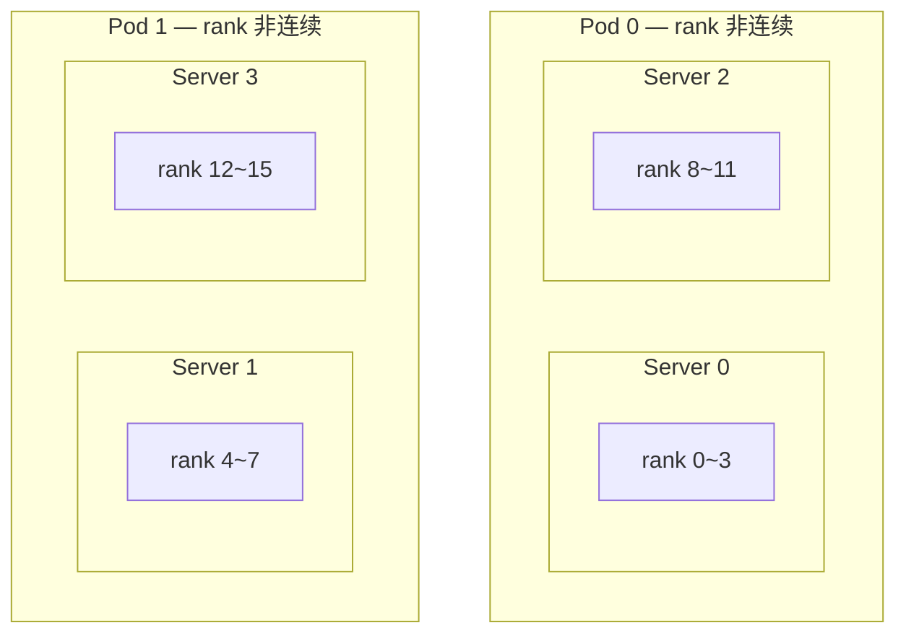
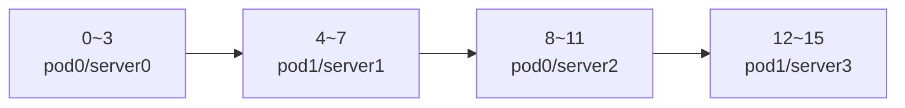
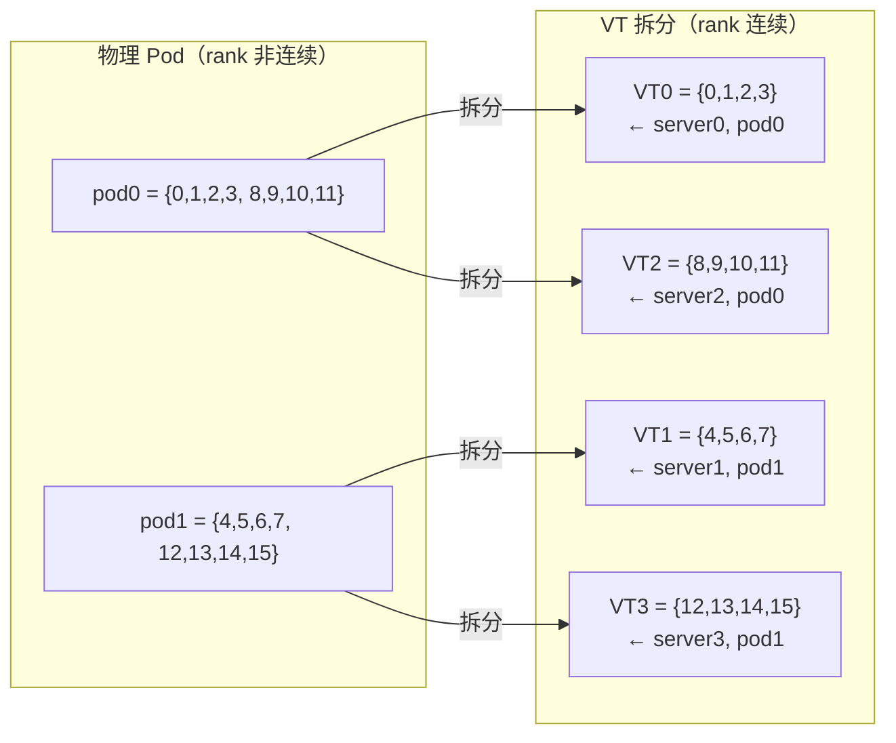
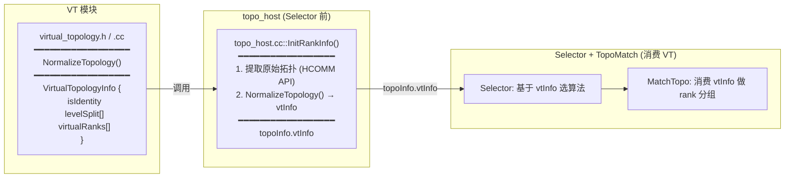

# HCCL 非连续拓扑支持方案：虚拟拓扑归一化

## 概述

HCCL 执行器通过模运算（`myRank_ % layer0Size`、`myRank_ / layer0Size` 等）计算各层级的 rank 索引，假设 rank ID 在每个拓扑层级内连续排列。当拓扑层级内 rank 非连续时（如 server-major 编号导致 pod 内 rank 交叉），模运算失效，通信组包含错误的 rank。

**方案**：虚拟拓扑（Virtual Topology, VT）归一化——对每个非连续的拓扑层级，按连续性拆分为虚拟 group，使模运算在每个虚拟 group 内自动正确。不做 rank 重映射，不修改执行器。

### 设计原则

- **L0（server）**：要求 rank 连续，不支持非连续
- **L1 ~ L[topoLevelNums-2]**：非连续则按连续性拆分为虚拟 group，虚拟 group 间通过上层 link 通信（逻辑链路，物理路径由 channel 建链决定）
- **L[topoLevelNums-1]（顶层）**：包含所有 rank，必然连续，不需拆分

### 典型场景

16P 通信域，4 个物理 server，每个 server 4 rank，2 个 pod。Rank 编号采用 server-major 排列，导致 pod 内 rank 非连续：



Rank 编号顺序（server-major）：



期望的分层通信组（以 rank 0 为例）：

| 层 | 通信组 | 物理链路 |
|----|--------|---------|
| Layer0（server 内） | `{0,1,2,3}` | HCCS/PCIE |
| Layer1（pod 内跨 server） | `{0, 8}` | pod 内交换机 |
| Layer2（跨 pod） | `{0, 4}` | 跨 pod 交换机 |

> A3（910_93）走完全不同的旧路径（`CalcGroupIdx` → `CalcGeneralTopoInfoForA3`），不经过 `TopoMatchMultilevel`，同样不支持非连续拓扑，需独立修复。本文不涉及 A3。

---

## 1. 问题根因

### 1.1 A5 路径分析（950/960）

A5 走 `TopoMatchMultilevel` 路径（`src/ops/op_common/topo/topo_match_multilevel.cc`）。

**拓扑匹配器各层验证**（以 rank 0 为例）：

| 代码点 | 文件:行 | 计算 | 结果 | 正确？ |
|--------|---------|------|------|--------|
| `TopoForLayer0` | `:24` | 查询 HCOMM 实际 rank 列表 | `{0,1,2,3}` | ✓ |
| `TopoForLayer1` | `:141` | `rankId % layer0Size`（=4） | `{0,8}` | ✓ |
| `TopoForLayer2` | `:221` | `rankId % (l0*l1)`（=8） | rank8 `8%8=0` 错误入选；rank4 `4%8=4` 错误排除 | **✗** |

`TopoForLayer2` 假设每个 pod 的 rank 连续且起始 rank 是 `l0*l1` 的整数倍。pod0={0,1,2,3,8,9,10,11} 非连续，rank 8 被错误纳入 L2 组（应仅含跨 pod rank），rank 4 被错误过滤。

**Executor rankIdx 验证**：

```cpp
// 2层 executor
rankIdxLevel0_ = myRank_ % rankSizeLevel0_;   // = myRank % 4
rankIdxLevel1_ = myRank_ / rankSizeLevel0_;   // = myRank / 4

// 3层 executor
rankIdxLevel0_ = (myRank_ % intraSuperpodDeviceNum) % rankSizeLevel0_;
rankIdxLevel1_ = (myRank_ % intraSuperpodDeviceNum) / rankSizeLevel0_;
rankIdxLevel2_ = myRank_ / intraSuperpodDeviceNum;
```

`rankIdxLevel0_` 正确（server 内 rank 连续）。`rankIdxLevel1_` 错误——`myRank / 4` 给出 server 索引（0,1,2,3）而非 L1 组内位置（0,1），rank 8/12 越界（组大小=2）。

**模板层不受影响**：模板使用 `GetAlgRank`（`std::find`），能正确处理非连续 rank。

### 1.2 三个瓶颈点

| 瓶颈点 | 位置 | 根因 |
|--------|------|------|
| `TopoForLayer2` 取模筛选 | `topo_match_multilevel.cc:221` | `rankId % (l0*l1)` 假设 pod rank 连续且起始为 `l0*l1` 倍数 |
| Executor rankIdx 算术 | 15+ executor 文件 | `myRank / l0` 假设 pod-major 编码，实际是 server-major |
| `CalcGroupIdx` 累计求和 | `topo_host.cc:253` | 累加 instance size 定位 pod，假设实例内 rank 连续 |

### 1.3 HCOMM RankGraph API

| API | 返回 | VT 用途 |
|-----|------|---------|
| `GetRanksByTopoInst(layer=N)` | 当前 rank 在 N 层所属实例的 rank 列表（已排序） | 检查各层连续性 |
| `GetLinks(layer=N, rankA, rankB)` | 两 rank 在 N 层是否有物理链路 | 顶层链路检查（循环所有下层） |
| `GetInstSizeListByLayer(layer=N)` | N 层所有实例的 rank 数量列表 | GCD 计算（非对称扩展） |
| `GetTopoInstsByLayer(layer=N)` | 当前 rank 在 N 层所属的拓扑实例列表 | 获取实例 ID |

**关键**：`GetRanksByTopoInst` 的 `netLayer` 参数可选择任意层级，API 是 level-agnostic 的。`GetLinks` 支持查询任意两个 rank 之间的链路。

---

## 2. VT 多层级设计

### 2.1 核心思路

将非连续的拓扑层级 rank 按**连续性拆分**为多个虚拟 group（VT group），每个 VT group 内 rank 连续。不同的 VT group 可能对应同一个物理实例。



拆分后，VT group 按 rank 连续分割整个 rank 空间（无间隙），执行器的模运算自动正确：

| rank | `myRank % 4` (L0) | `(myRank/4) % 1` (L1) | `myRank / 4` (L2) | 正确？ |
|------|-------------------|----------------------|-------------------|--------|
| 0 | 0 | 0 | 0 (VT0) | ✓ |
| 4 | 0 | 0 | 1 (VT1) | ✓ |
| 8 | 0 | 0 | 2 (VT2) | ✓ |
| 12 | 0 | 0 | 3 (VT3) | ✓ |

L1 变为 trivial（每个 VT group 只有一个 server，`layer1Size=1`），所有跨 server 通信在 L2 进行。

### 2.2 多层级泛化

**设计原则**：

```
L0 (server):              要求连续，不拆分
L1 ~ L[topoLevelNums-2]:  非连续则拆分为 VT group
L[topoLevelNums-1] (顶层): 包含所有 rank，必然连续，不拆分
```

**拆分机制**：对 level L（1 ≤ L ≤ topoLevelNums-2），获取该层实例的 rank 列表，检查连续性。非连续时按连续性拆分为子组，每个子组成为一个 VT group。拆分后 `layerLSize` 变为子组大小除以下层尺寸（通常 = 1，即该层 trivial 化）。虚拟 group 间通过上层 link 通信（逻辑链路），物理路径由 channel 建链从 L0 向上搜索决定。

**过滤器自动适应**：拆分 level L 使 `layerLSize=1`，上层过滤器 `rankId % (l0 * l1 * ... * lL)` 中的 `lL` 变为 1，乘积减小。拆分所有中间层后，顶层过滤器恒为 `rankId % layer0Size`，与所有层级的连续性无关。

| 拓扑层级数 | 处理的 level | 顶层过滤器 | 顶层链路检查 |
|-----------|-------------|-----------|------------|
| 3 级 | L1 | `rankId % l0`（L1 拆分后 `l1=1`） | `GetLinks(L1) \|\| GetLinks(L2)` |
| 4 级（未来） | L1, L2 | `rankId % l0`（L1+L2 拆分后 `l1=l2=1`） | `GetLinks(L1) \|\| GetLinks(L2) \|\| GetLinks(L3)` |

**3 级拓扑是特例**：`topoLevelNums=3`，顶层 L2 包含所有 rank（0 到 N-1），必然连续。只有 L1 可能非连续，需拆分。当前代码限制 `topoLevelNums ≤ 3`，VT 模块按 level-agnostic 结构设计，未来放开限制时自动支持 4+ 级。

### 2.3 通道创建的物理路径优化

通道创建遍历 `netLayersVector`（升序：L0 → L1 → L2），在第一个有链路的层 `break`：


即使算法把 rank0 和 rank8 放在 L2 组里，通道创建仍找到 L1 链路（更高带宽），物理路径最优。

### 2.4 性能分析

| 指标 | 正常 3 级（连续 pod） | VT 拆分后 |
|------|---------------------|----------|
| L0 步数 | log2(4)=2 | log2(4)=2 |
| L1 步数 | log2(2)=1 | 0（trivial） |
| L2 步数 | log2(2)=1 | log2(4)=2 |
| **总步数** | **4** | **4**（相同） |
| L2 物理路径 | 全部 L2 链路 | 同 pod 用 L1，跨 pod 用 L2 |

总步数相同。VT 方案中同 pod 通信使用更高带宽的 L1 链路，可能比原方案更快。

---

## 3. 实现设计

### 3.1 架构总览



- `virtual_topology.h/.cc` 不依赖任何 matcher 或 topo_host，仅依赖 HCOMM API
- `topo_host` 在 `InitRankInfo()` 末尾调用 `NormalizeTopology`，结果存入 `topoInfo.vtInfo`
- Selector 基于 `vtInfo` 选择算法（有效层级、GCD 退化等）
- `MatchTopo` 消费 `topoInfo.vtInfo` 做 rank 组选择，不再调用 `NormalizeTopology`
- 其他 matcher（`topo_match_3_level`、`topo_match_ubx` 等）可直接消费 `topoInfo.vtInfo`

### 3.2 VirtualTopologyInfo 结构体

```cpp
namespace ops_hccl {

struct VirtualTopologyInfo {
    bool isIdentity = true;  // true = 所有 level 连续，无需拆分

    // 每个 level 的虚拟信息（index 0 = L1, 1 = L2, ...）
    std::vector<bool> levelSplit;                     // 该 level 是否拆分
    std::vector<std::vector<uint32_t>> virtualRanks;  // myRank 所在 VT group 的 rank 列表
};

}
```

### 3.3 NormalizeTopology 函数

在 `topo_host::InitRankInfo()` 末尾调用（Selector 前），结果存入 `topoInfo.vtInfo`：

```
NormalizeTopology(comm, myRank, topoInfo, vtInfo):
    numProcessLevels = topoInfo->topoLevelNums - 1  // 不含 L0 和顶层
    vtInfo.levelSplit.resize(numProcessLevels, false)
    vtInfo.virtualRanks.resize(numProcessLevels)

    for level = 1 to topoInfo->topoLevelNums - 2:  // L1 ~ L[top-2]
        netLayer = topoInfo->netLayerList[level]
        idx = level - 1

        1. GetRanksByTopoInst(netLayer, topoInsts[0]) → ranks[]
        2. 检查连续性: ranks[i] == ranks[0] + i 对所有 i
        3. 连续 → levelSplit[idx] = false, virtualRanks[idx] = 全部 rank
        4. 非连续 → 按连续性拆分:
           a. ranks[i] != ranks[i-1]+1 时断开
           b. 找到 myRank 所在连续子组 → virtualRanks[idx]
           c. levelSplit[idx] = true, isIdentity = false
```

**3 级拓扑**：`numProcessLevels = 2`，循环只跑 `level=1`（L1）。顶层 L2 包含所有 rank，必然连续，不在循环范围内。

### 3.4 Matcher 变更

#### MatchTopo 流程（3 级）

VT 已在 `topo_host` 中预计算，MatchTopo 直接消费 `topoInfo.vtInfo`：

```
1. // vtInfo 已在 topoInfo 中（topo_host 预计算）
2. TopoForLayer0(...)                                   // 不变
3. TopoForLayer1(..., topoInfo->vtInfo)                 // 消费预计算的 vtInfo
4. TopoForLayer2(..., topoInfo->vtInfo)                 // 顶层，链路检查所有下层
```

#### TopoForLayer1（非顶层）

```cpp
if (vtInfo.levelSplit[0]) {
    // 非连续：使用 VT rank（已拆分为连续子组）
    podRanks = vtInfo.virtualRanks[0];
} else {
    // 连续：从 HCOMM 获取（现有行为）
    GetRanksByTopoInst(netLayer, topoInsts[0], &ranks, &rankNum);
    podRanks = {ranks, ranks + rankNum};
}
// 后续过滤逻辑不变（同位置 + GetLinks 检查）
```

#### TopoForLayer2（顶层）

**链路检查**从仅查 L2 改为循环所有下层：

```cpp
// 变更前:
GetLinks(comm, netLayer, myRank, rankId, &links, &linkNum);  // 仅 L2
if (linkNum == 0) continue;

// 变更后: 循环检查 L1 ~ L[top]
for (uint32_t level = 1; level < topoInfo->topoLevelNums; level++) {
    uint32_t lowerNetLayer = topoInfo->netLayerList[level];
    GetLinks(comm, lowerNetLayer, myRank, rankId, &links, &linkNum);
    if (linkNum > 0) break;
}
if (linkNum == 0) continue;
```

**模运算过滤器自动适应**：VT 拆分后 `layer1Size=1`，过滤器 `rankId % (l0*l1)` 变为 `rankId % l0`，选择所有同位置 rank。正常场景 `layer1Size>1`，过滤器不变，同 pod rank 被排除。

### 3.5 文件变更清单

| 文件 | 类型 | 改动 |
|------|------|------|
| `src/ops/op_common/topo/virtual_topology.h` | **新建** | `VirtualTopologyInfo` 结构体 + `NormalizeTopology` 声明 |
| `src/ops/op_common/topo/virtual_topology.cc` | **新建** | 连续性检查 + 拆分实现（~40 行） |
| `src/ops/op_common/topo/topo_host.cc` | 修改 | `InitRankInfo()` 末尾调用 `NormalizeTopology`，结果存入 `topoInfo->vtInfo` |
| `src/ops/op_common/inc/alg_param.h` | 修改 | `TopoInfoWithNetLayerDetails` 增加 `VirtualTopologyInfo vtInfo` 字段 |
| `src/ops/op_common/topo/topo_match_multilevel.h` | 修改 | 函数签名加 `vtInfo` 参数 |
| `src/ops/op_common/topo/topo_match_multilevel.cc` | 修改 | `TopoForLayer1` 消费 `vtInfo`；`TopoForLayer2` 循环链路检查 |
| `src/ops/op_common/topo/CMakeLists.txt` | 修改 | 添加 `virtual_topology.cc` |

**总变更：2 个新文件 + 5 个修改文件，约 100-120 行代码。**

**不需要修改的文件：执行器（0）、模板（0）、通道创建（0）、Selector（初期不变，后续可用 vtInfo 替代 Level1Nhr）。**

---

## 4. 安全性验证

### 4.1 trivial level 安全性

VT 拆分后 L1 组可能只有 1 个 rank。验证结果：

- **3 级执行器**：全部有 `skipLevel1_` 标志，`rankSizeLevel1_ == 1` 时完全跳过 L1 模板。**安全**。
- **NHR 模板**：`GetNHRStepNum(1) = 0`，0 步通信。**安全**。
- **Mesh 模板**：循环 `for (rankIdx = 1; rankIdx < templateRankSize_; rankIdx++)` 不执行。**安全**。
- **2 级执行器**：模板层有 `if (templateRankSize_ == 1) return` 守卫。功能正确。

### 4.2 正常场景无影响

| 变更点 | 正常场景（rank 连续） | 影响 |
|--------|---------------------|------|
| `TopoForLayer1` VT 拆分 | `isIdentity=true`，走原路径 `GetRanksByTopoInst` | **无** |
| `TopoForLayer2` 链路检查 | 模运算过滤器已排除同 pod rank | **无** |
| 模运算过滤器 | `layer1Size>1`，过滤器 `rankId % (l0*l1)` 不变 | **无** |

### 4.3 一致性保证

**问题**：如果不同 VT group 包含不同数量的 L0 组，`layer1Size` 因 rank 而异，导致 L2 模运算过滤器不一致——rankA 包含 rankB 但 rankB 不包含 rankA。

**保证**：对称拓扑下（当前支持范围），server-major 编号保证如果一个 pod 非连续，所有 pod 都非连续（rank 空间间隙必然属于其他 pod）。所有 VT group = 1 个 server 的 rank → `layer1Size=1` 全局一致 → L2 过滤器 `rankId % layer0Size` 全局一致 → L2 组对称。

```
保证链:
对称拓扑 → 所有 server 卡数相同
    → VT 拆分后每个 VT = 1 个 server = 1 个 L0 组
    → layer1Size = 1（所有 rank）
    → L2 过滤器 = rankId % layer0Size（全局一致）
    → L2 组对称：rankA 包含 rankB ⟺ rankB 包含 rankA ✓
```

> **非对称扩展**：当 server 间卡数不同时，VT 模块可扩展 GCD 拆分——每个连续子组按 GCD 大小进一步拆分，确保每个 VT group = 1 个 L0 组，`layer1Size=1` 全局一致。详见 [`asymmetric-topology-analysis.md`](./asymmetric-topology-analysis.md)。

### 4.4 场景推演汇总

| 场景 | VT 拆分 | layer1Size | L2 一致性 | 状态 |
|------|---------|-----------|----------|------|
| 对称交叉 Pod（2/3+ pod） | ✓ 连续性 | 1（所有 rank） | ✓ | 支持 |
| 对称交叉 Pod（3+ server/pod） | ✓ 连续性 | 1（所有 rank） | ✓ | 支持 |
| 正常对称 3 级 | 恒等 | >1（原值） | ✓ | 无影响 |
| 正常 2 级 / HostDPU 降级 | 恒等 | — | — | 不涉及（无 L2） |
| 非对称 3 级 | ✓ 连续性 + GCD | 1（所有 rank） | ✓ | GCD 扩展后预埋 |

---

## 5. ST 测试

### 5.1 ST 模拟器限制

ST 模拟器 `TopoModel` 构造函数按 pod-major 顺序连续分配 rankId，无法直接产生非连续 pod rank。需要后续改造 ST 基础设施（增加 `rankOverride` 参数），作为独立任务。

### 5.2 临时验证方案

使用 4-pod 拓扑（每 pod 1 server）验证 3 级层级在 L1 trivial 时的正确性：

```cpp
// 4 pods, 1 server each, 4 ranks per server
TopoMeta topoMeta{{{0,1,2,3}}, {{0,1,2,3}}, {{0,1,2,3}}, {{0,1,2,3}}};
```

此拓扑下 L1 trivial（每 pod 1 server），可验证 `skipLevel1_` 路径。但无法测试 VT 拆分逻辑本身（pod rank 已连续）。

### 5.3 完整测试矩阵（ST 改造后）

| 用例 | 验证点 | 期望结果 |
|------|--------|---------|
| AllReduce 3层 | L2 通信组正确 | 跨 pod 通信正常 |
| AllGather 3层 | 输出数据布局正确 | 数据无错位 |
| ReduceScatter 3层 | 输入读取位置正确 | 结果正确 |
| Broadcast 3层 | root 位置正确 | root 数据正确传播 |
| 正常拓扑回归 | 恒等映射，行为不变 | 结果与修改前一致 |

---

## 6. 结论

- **根因**：代码假设 rank 按 pod-major 排列，用算术（取模/整除）替代查表。非连续拓扑下 pod 内 rank 非连续，算术失效。
- **方案**：虚拟拓扑归一化——将非连续层级按连续性拆分为 VT group，不做 rank 重映射。
- **多层级**：L0 要求连续；L1~L[topoLevelNums-2] 非连续则拆分；顶层必然连续不拆分。拆分使中间层 trivial 化，顶层过滤器简化为 `rankId % layer0Size`。
- **零改动**：执行器（0）、模板（0）、通道创建（0）。rank ID 不变，模运算在连续 VT rank 上自动正确。通道创建从 L0 向上搜索最佳物理路径。
- **改动量**：约 80-100 行（2 新 + 3 改）。
- **A3 路径**：不涉及，需独立修复。

---

*参考：[`asymmetric-topology-analysis.md`](./asymmetric-topology-analysis.md) 分析卡数不一致的非对称场景及 VT 的 GCD 扩展。*
